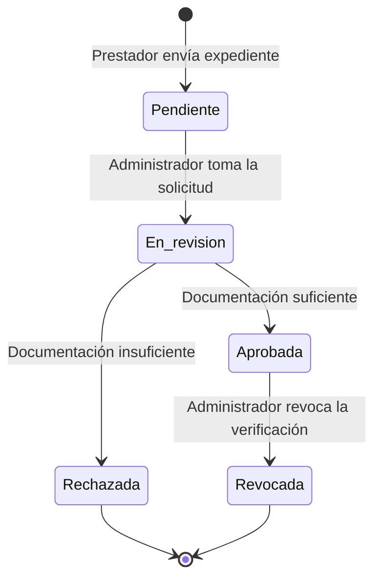
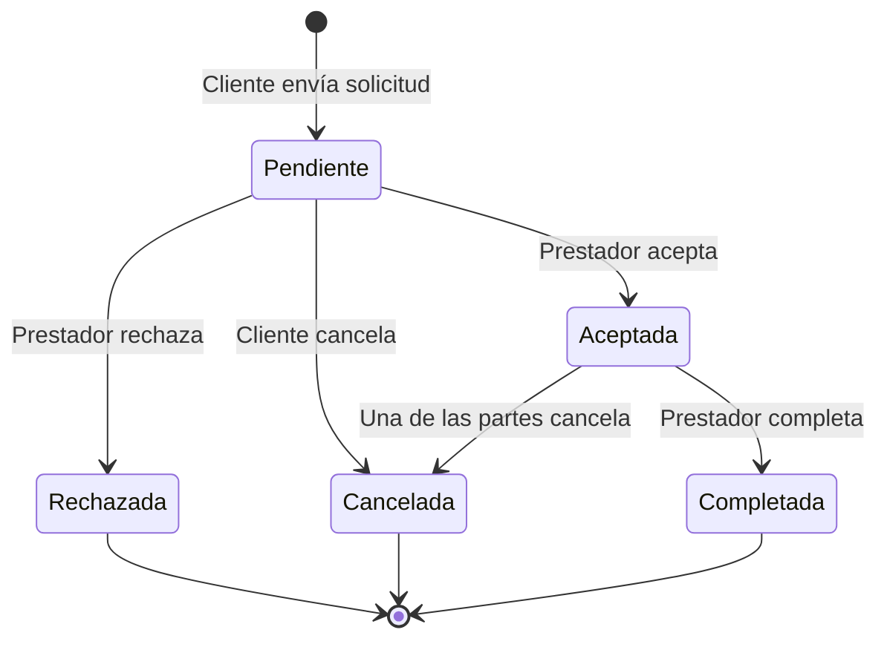
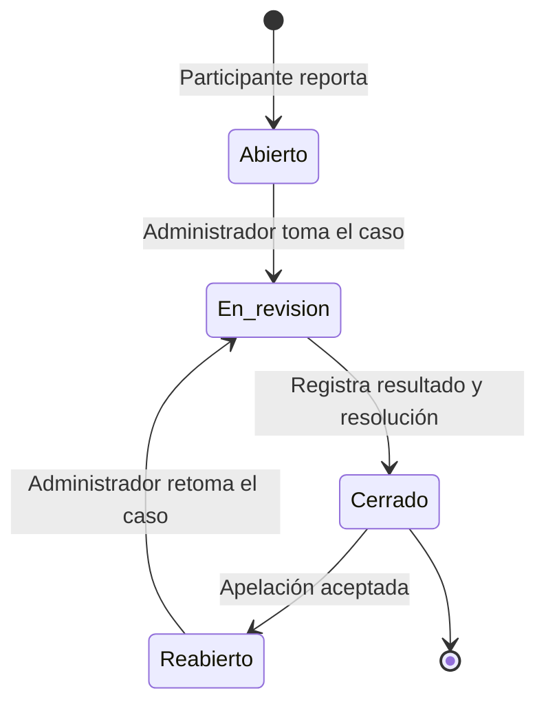

# Moica — Definición base del producto

> Documento de incorporación y referencia funcional para Nova Studios. Establece el problema que resuelve Moica, su propuesta de valor, el alcance del MVP y las reglas que orientarán la arquitectura, los diagramas y el modelo de datos.

| Dato | Definición |
|---|---|
| Estado | Definición funcional consolidada |
| Proyecto | Hackathon UAM 2026 — categoría Avanzado |
| Reto | Conecta Emprende |
| Equipo | Nova Studios |
| Última actualización | 10 de agosto de 2026 |

---

## 1. Contexto del reto

El reto Conecta Emprende parte de la desconexión entre quienes ofrecen servicios y las personas o empresas que los necesitan. En el contexto local, gran parte de esta oferta se promociona mediante redes sociales, recomendaciones personales y contactos informales. La información se encuentra dispersa y no siempre ofrece mecanismos suficientes para conocer la experiencia, disponibilidad o reputación de un prestador.

El reto también contempla la conexión con proveedores de insumos, materia prima y equipos productivos. Sin embargo, Moica concentrará su MVP en la contratación de servicios. Esta delimitación permite atender una parte clara y relevante del problema mediante un ciclo funcional completo y viable para el tiempo y los recursos de la hackathon. La incorporación de proveedores e insumos podrá evaluarse como una expansión futura.

## 2. Definición del producto

Moica es una aplicación web progresiva (PWA) mobile-first que conecta clientes con trabajadores independientes, emprendimientos y pequeñas empresas que ofrecen servicios. Permitirá descubrir prestadores mediante perfiles que integran presentación profesional, servicios publicados, trabajos de portafolio, disponibilidad, cobertura, nivel de verificación y reputación.

El acceso será inmediato y la validación posterior: cualquier cuenta podrá crear y preparar su perfil de prestador desde el primer momento, pero para aparecer públicamente deberá superar una verificación documental revisada por una persona administradora.

A diferencia de un directorio convencional, Moica permitirá gestionar el inicio y el seguimiento básico de la relación mediante solicitudes de servicio. Cuando el prestador acepte una solicitud, se habilitarán un chat de texto y sus medios de contacto externos. Después de realizar el trabajo, el prestador marcará la solicitud como completada y ambas partes podrán calificarse de manera opcional.

La PWA será instalable y se diseñará primero para teléfonos, con adaptación responsiva a tabletas y computadoras. Una aplicación móvil nativa queda fuera del MVP.

## 3. Propuesta de valor

Moica busca que encontrar y contactar a un prestador local resulte más organizado y confiable que hacerlo únicamente mediante publicaciones dispersas o recomendaciones informales.

La plataforma aportará valor mediante:

- Un espacio centralizado para descubrir prestadores y servicios.
- Verificación documental en dos etapas, revisada por una persona, que respalda la identidad y la trayectoria declarada de quien ofrece un servicio.
- Perfiles que reúnan la presentación profesional, los servicios y el portafolio del prestador.
- Información sobre disponibilidad, municipio y cobertura aproximada.
- Solicitudes que dejen registro del inicio y evolución de cada contratación.
- Comunicación básica dentro de la plataforma y revelación controlada de contactos externos.
- Reputación basada en interacciones realmente registradas.
- Herramientas de reporte y moderación ante problemas entre participantes.

## 4. Usuarios y formas de acceso

### 4.1 Visitante

La exploración de perfiles y servicios será pública. Un visitante podrá buscar y consultar información pública, pero deberá registrarse o iniciar sesión para enviar una solicitud o realizar cualquier acción vinculada con una contratación.

### 4.2 Cuenta de usuario y vista de cliente

Toda cuenta ordinaria comenzará con la capacidad de actuar como cliente. No será necesario elegir permanentemente entre cliente y prestador durante el registro.

Como cliente, una cuenta podrá:

- Explorar perfiles y servicios.
- Consultar el portafolio, la cobertura, la disponibilidad y la reputación de un prestador.
- Enviar solicitudes de servicio.
- Cancelar una solicitud pendiente o aceptada según las reglas establecidas.
- Conversar con un prestador después de que acepte la solicitud.
- Acceder a los medios de contacto externos habilitados.
- Calificar al prestador cuando la solicitud sea completada.
- Reportar a la contraparte desde que la solicitud haya sido aceptada.

### 4.3 Perfil y vista de prestador

Una cuenta podrá crear un perfil de prestador para comenzar a ofrecer servicios. Al hacerlo, conservará también su capacidad de contratar a otros prestadores y podrá alternar entre las vistas de cliente y prestador.

Como prestador, una cuenta podrá:

- Crear y actualizar su perfil profesional.
- Presentar su expediente documental para obtener la verificación básica y, después, la verificación profesional opcional.
- Consultar el estado y la observación de sus propias solicitudes de verificación.
- Publicar y administrar varios servicios.
- Gestionar los trabajos mostrados en su portafolio.
- Indicar si se encuentra disponible o no disponible.
- Definir su municipio principal y describir de forma libre su cobertura.
- Configurar varias entradas libres de contacto externo.
- Recibir, aceptar o rechazar solicitudes.
- Conversar con los clientes cuyas solicitudes haya aceptado.
- Cancelar una solicitud aceptada cuando no pueda continuar, indicando el motivo.
- Marcar una solicitud aceptada como completada.
- Calificar al cliente cuando la solicitud sea completada.
- Reportar a la contraparte desde que la solicitud haya sido aceptada.

Un prestador podrá contratar a otro, incluso si ambos ofrecen servicios similares. Lo único prohibido será solicitar un servicio publicado por su propia cuenta.

### 4.4 Administrador

El administrador será una cuenta del mismo sistema de identidad con un rol administrativo. Esto permitirá registrar qué administrador revisó y resolvió cada caso de moderación.

Las funciones administrativas se ubicarán en el área `/admin` del mismo frontend React de Moica. El acceso a esa área exigirá dos condiciones simultáneas: que la cuenta posea el rol administrativo y que su sesión haya verificado el segundo factor.

El administrador podrá:

- Consultar las solicitudes de verificación de prestadores y tomarlas para su revisión.
- Abrir los documentos del expediente, aprobar o rechazar la solicitud y revocar una verificación ya concedida.
- Consultar los casos de moderación recibidos.
- Revisar la solicitud, los participantes, el historial de estados y los mensajes relacionados.
- Asignarse un caso o reasignarlo a otro administrador.
- Cambiar el estado del caso entre `ABIERTO`, `EN_REVISION`, `CERRADO` y `REABIERTO`.
- Registrar la resolución indicando si el caso resultó `PROCEDENTE` o `DESESTIMADO`.
- Gestionar el catálogo de medidas administrativas: crearlas, editarlas y deshabilitarlas.
- Aplicar manualmente una medida administrativa del catálogo, sustituirla o revocarla cuando corresponda.
- Registrar las apelaciones recibidas por el canal externo, resolverlas y reabrir un caso ya cerrado cuando proceda.

### 4.5 Autenticación, sesiones y segundo factor

El inicio de sesión se realizará con correo y contraseña. La contraseña se guardará únicamente como hash.

Cada inicio de sesión creará una sesión registrada por Moica. El token entregado al navegador llevará el identificador de esa sesión, de modo que la plataforma pueda comprobar en cada petición si sigue siendo válida. Esto permite dos cosas que un token autónomo no permitiría:

- **Expiración.** Toda sesión nace con una fecha de expiración; al alcanzarla deja de ser válida aunque el token no haya cambiado.
- **Revocación.** Una sesión puede invalidarse antes de expirar cuando la persona cierra sesión, cuando cambia sus credenciales o cuando una medida administrativa afecta a la cuenta. La sesión conservará el instante y el motivo de la revocación.

El segundo factor será de tipo TOTP: la persona registrará un secreto en una aplicación autenticadora que genera códigos temporales.

- Será obligatorio para toda cuenta con rol administrativo.
- Será opcional para el resto de las cuentas, que podrán activarlo o desactivarlo cuando lo deseen.
- Cada cuenta podrá registrar como máximo un segundo factor, que pasará por los estados `PENDIENTE_ACTIVACION`, `ACTIVO` y `DESACTIVADO`.
- Cada sesión registrará si superó la verificación del segundo factor; el área `/admin` solo aceptará sesiones que la hayan superado.

El segundo factor y la verificación documental del prestador son mecanismos distintos y no se sustituyen entre sí. El TOTP protege el inicio de sesión de una cuenta; la verificación documental descrita en la sección 5.6 respalda la identidad y la trayectoria de un perfil de prestador ante el resto de la comunidad. Una cuenta puede tener TOTP activo y un perfil sin verificar, o un perfil verificado y ningún segundo factor.

## 5. Perfil del prestador

Cada cuenta podrá poseer como máximo un perfil de prestador. Este será una extensión de la cuenta y no una cuenta independiente.

El perfil incluirá, como mínimo:

- Nombre personal, comercial o profesional.
- Fotografía o imagen de perfil.
- Descripción o presentación.
- Tipo de prestador.
- Municipio principal.
- Descripción libre de cobertura.
- Disponibilidad.
- Nivel de verificación vigente.
- Medios de contacto externos.
- Trabajos de portafolio.
- Reputación como prestador.

### 5.1 Tipo de prestador

El tipo de prestador tendrá inicialmente tres opciones:

- Independiente.
- Emprendimiento.
- PYME.

Profesionales y freelancers se incluirán dentro de la categoría independiente. Este dato será descriptivo y se mostrará en el perfil; no cambiará permisos ni funciones en el MVP. Se conserva para facilitar posibles usos futuros, como personalizar recomendaciones.

El tipo de prestador no debe confundirse con la categoría de sus servicios. Por ejemplo, una PYME y un trabajador independiente pueden ofrecer servicios pertenecientes a la misma categoría.

### 5.2 Ubicación y cobertura

El MVP operará únicamente en el departamento de Managua. Aun así, el modelo conservará una estructura escalable de `Departamento → Municipio` para permitir la incorporación de otros departamentos posteriormente.

Cada perfil seleccionará un municipio principal y contará con un texto libre para precisar barrios, sectores, comarcas, puntos de referencia o límites de atención. No se almacenarán nombres históricos de lugares durante el MVP.

No se incluirán mapas, coordenadas ni geolocalización automática.

### 5.3 Disponibilidad

La disponibilidad tendrá únicamente dos estados:

- `DISPONIBLE`.
- `NO_DISPONIBLE`.

Cuando un prestador esté no disponible, sus servicios dejarán de presentarse como opciones habilitadas para contratación y el sistema bloqueará el envío de nuevas solicitudes dirigidas a ellos. Las nuevas solicitudes no quedarán en espera.

| Estado actual | Acción del prestador | Estado resultante | Efecto |
|---|---|---|---|
| `DISPONIBLE` | Dejar de recibir solicitudes | `NO_DISPONIBLE` | Oculta sus servicios de las opciones habilitadas y bloquea nuevas solicitudes. |
| `NO_DISPONIBLE` | Volver a atender | `DISPONIBLE` | Sus servicios activos vuelven a admitir solicitudes. |

### 5.4 Medios de contacto

El prestador podrá guardar varias entradas de contacto en formato libre. Cada entrada podrá contener, por ejemplo, un número telefónico, un correo, un nombre de usuario, un enlace o cualquier otro texto útil.

Moica no clasificará estos registros como WhatsApp, Facebook, Instagram u otra plataforma. Su contenido permanecerá oculto para el cliente hasta que el prestador acepte la solicitud.

### 5.5 Portafolio

El portafolio será una sección del perfil, no un módulo ni un perfil independiente. Estará compuesto por varios trabajos o proyectos anteriores. Cada trabajo podrá incluir:

- Título.
- Descripción.
- Fecha de realización, si se desea mostrar.
- Varias imágenes opcionales.
- Orden de visualización.

En el modelo de datos, cada trabajo se relacionará directamente con el perfil del prestador. No se requiere una entidad contenedora `Portafolio` mientras este no posea atributos propios.

### 5.6 Verificación del prestador

La verificación es el mecanismo con el que Moica respalda que detrás de un perfil existe una persona real y, opcionalmente, una trayectoria comprobable. Se aplica al perfil de prestador y no a las cuentas que solo actúan como clientes.

El principio operativo es **acceso inmediato y validación posterior**: una cuenta puede registrarse, crear su perfil, escribir su presentación, cargar su portafolio y preparar sus servicios desde el primer momento. Lo que depende de la verificación es la salida al público, no la preparación.

#### Niveles de verificación

| Nivel | Significado | Efecto |
|---|---|---|
| `SIN_VERIFICAR` | Estado inicial de todo perfil recién creado. | El perfil es privado: no aparece en el descubrimiento público, no puede tener servicios activos y no recibe solicitudes. |
| `VERIFICADO_BASICO` | Una persona administradora revisó y aprobó la documentación oficial de identidad de la persona responsable del perfil. | El perfil puede hacerse público, activar servicios y recibir solicitudes. Muestra la insignia **Verificado Básico**. |
| `PROFESIONAL_VERIFICADO` | Después de la verificación básica, una persona administradora revisó y aprobó documentación profesional, técnica o comercial que respalda la actividad declarada. | Conserva todo lo anterior y muestra la insignia superior **Profesional Verificado**. |

La verificación profesional es opcional y progresiva: exige una verificación básica vigente y no sustituye ninguno de sus efectos. La básica basta para operar; la profesional distingue.

#### Solicitudes de verificación

Cada intento de obtener o renovar un nivel se registra como una solicitud de verificación con su propio expediente documental. Una solicitud recorre estos estados:

| Estado | Significado |
|---|---|
| `PENDIENTE` | El prestador envió su expediente y espera revisión. |
| `EN_REVISION` | Una persona administradora tomó la solicitud y analiza los documentos. |
| `APROBADA` | La documentación fue aceptada y el perfil alcanzó el nivel solicitado. |
| `RECHAZADA` | La documentación no fue aceptada. Exige una observación que explique el motivo. |
| `REVOCADA` | Una verificación previamente aprobada quedó sin efecto. Exige una observación que explique el motivo. |

Reglas del flujo:

- Solo puede existir una solicitud abierta —`PENDIENTE` o `EN_REVISION`— del mismo nivel por perfil.
- Cada nivel se solicita cuando corresponde: la básica cuando el perfil está `SIN_VERIFICAR`, y la profesional cuando tiene la básica vigente y todavía no la profesional. Pedir un nivel que ya está vigente no es una renovación silenciosa sino un conflicto, y así se responde.
- La solicitud y su expediente nacen juntos: no existe un estado `BORRADOR` ni un momento en el que exista una solicitud sin documentos. Los documentos no se editan ni se sustituyen después de enviarlos; corregir algo significa presentar una solicitud nueva.
- Solo la persona administradora que tomó una revisión puede aprobarla o rechazarla. Revocar, en cambio, no exige haberla tomado: la aprobó otra persona en otro momento y esa revisión ya está cerrada.
- Una solicitud rechazada puede volver a presentarse con documentos corregidos; se registra como una solicitud nueva y la anterior se conserva.
- Si se rechaza una solicitud profesional, el perfil conserva su nivel básico.
- La revisión es siempre manual: la ejecuta una cuenta con rol administrativo cuya sesión haya verificado el segundo factor. Moica no aprueba, rechaza ni revoca verificaciones de forma automática.
- Toda decisión negativa —rechazo o revocación— exige registrar una observación o motivo.

#### Efectos de una revocación

Si se revoca la verificación básica, el perfil vuelve a `SIN_VERIFICAR`: deja de aparecer públicamente, sus servicios dejan de admitir nuevas solicitudes y cualquier nivel profesional deja de surtir efecto. Las solicitudes ya aceptadas conservan su flujo normal —chat, cancelación, finalización y calificación— para no dejar compromisos abiertos sin cierre.

«Dejar de surtir efecto» significa exactamente esto: la solicitud profesional aprobada queda también `REVOCADA`, **en la misma operación** y con el mismo motivo, la misma persona administradora y el mismo instante que la básica. No es una consecuencia diferida ni un estado intermedio: una profesional que sobreviviera diría que Moica respalda la trayectoria de alguien cuya identidad ya no respalda.

Esa revocación **no se deshace sola**. Si el perfil vuelve a obtener la verificación básica, recupera `VERIFICADO_BASICO` y nada más: la insignia profesional exige una solicitud nueva, con su propio expediente y su propia revisión.

Revocar la verificación profesional, en cambio, solo la afecta a ella: el perfil queda en `VERIFICADO_BASICO` y conserva todo lo que ese nivel permite.

Una revocación no borra nada. La solicitud revocada y sus documentos se conservan como evidencia de qué se revisó, quién lo decidió y por qué.

#### Expediente documental y privacidad

El expediente se compone de los archivos que el prestador adjunta a su solicitud. Los documentos admitidos serán JPEG, PNG o PDF, con un tamaño máximo inicial configurable de 5 MB por archivo.

- Los archivos se almacenan como recursos privados. Moica guarda una clave opaca de almacenamiento y los metadatos del documento, nunca el archivo binario ni una dirección pública permanente.
- Solo la persona propietaria del perfil puede enviar documentos y consultar los metadatos de su propio expediente.
- Solo un administrador con segundo factor verificado puede abrir los archivos y resolver la solicitud.
- Ningún documento, número de identificación, clave de almacenamiento ni observación administrativa es público.
- Un visitante solo ve la insignia o el nivel vigente y una explicación breve de lo que significa.

#### Qué significa y qué no significa una insignia

Las insignias indican que Moica revisó la documentación presentada en un momento determinado. No garantizan la calidad futura del trabajo ni sustituyen el criterio del cliente. La calidad y la reputación se siguen respaldando mediante el portafolio y las calificaciones vinculadas a solicitudes completadas.

## 6. Servicios, categorías y descubrimiento

Cada publicación representará un servicio concreto ofrecido por un prestador. Incluirá, como mínimo:

- Nombre del servicio.
- Descripción.
- Subcategoría principal.
- Precio de referencia opcional.
- Varias imágenes opcionales.
- Estado de publicación.

Si el prestador no indica un precio de referencia, la interfaz mostrará “A convenir”. Cuando corresponda, el precio podrá presentarse como una referencia o como un valor “desde”; no representará todavía una cotización final ni un pago dentro de Moica.

La clasificación utilizará categorías generales y subcategorías. Cada servicio pertenecerá a una sola subcategoría principal, y cada subcategoría pertenecerá a una categoría general. Esta estructura permitirá búsquedas más precisas sin asignar múltiples categorías al mismo servicio durante el MVP.

El estado de un servicio tendrá únicamente dos valores:

- `ACTIVO`.
- `INACTIVO`.

Solo un servicio activo perteneciente a un prestador disponible y con verificación básica vigente podrá mostrarse públicamente y recibir nuevas solicitudes. Los servicios asociados con solicitudes anteriores no se eliminarán físicamente; se desactivarán para preservar el historial.

| Estado actual | Acción del prestador | Estado resultante | Efecto |
|---|---|---|---|
| `ACTIVO` | Desactivar publicación | `INACTIVO` | Deja de aparecer como opción habilitada y no admite nuevas solicitudes. |
| `INACTIVO` | Activar publicación | `ACTIVO` | Puede volver a mostrarse y recibir solicitudes si el prestador está disponible. |

La exploración podrá combinar, como mínimo, texto, categoría o subcategoría y municipio. El texto libre de cobertura complementará el filtro territorial cuando un prestador no atienda todo el municipio. El descubrimiento público solo incluirá perfiles con verificación básica vigente, y cada resultado mostrará la insignia correspondiente al nivel del prestador.

## 7. Solicitud de servicio

La solicitud registrará el interés de un cliente en un servicio publicado. Contendrá:

- Servicio solicitado.
- Cliente solicitante.
- Descripción de la necesidad.
- Municipio donde se requiere el servicio.
- Dirección, sector o referencia escrita libremente.
- Fecha preferida opcional.
- Estado actual.
- Fecha de creación y última actualización.

Para crearla, el usuario deberá estar autenticado, el servicio deberá estar activo, el prestador deberá estar disponible y con verificación básica vigente, y la cuenta solicitante no podrá ser la propietaria del servicio.

## 8. Estados e historial de una solicitud

### 8.1 Significado de los estados

| Estado | Significado |
|---|---|
| `PENDIENTE` | La solicitud fue enviada y espera la decisión del prestador. |
| `ACEPTADA` | El prestador aceptó realizar el servicio; se habilitan el chat y los contactos. |
| `RECHAZADA` | El prestador decidió no aceptar la solicitud. |
| `CANCELADA` | Una de las partes terminó el proceso antes de completarlo. |
| `COMPLETADA` | El prestador indicó que el servicio fue realizado; se habilitan las calificaciones. |

### 8.2 Matriz de transiciones

| Estado actual | Acción | Actor autorizado | Estado resultante | Regla o efecto |
|---|---|---|---|---|
| Sin solicitud | Enviar solicitud | Cliente | `PENDIENTE` | Requiere servicio activo, prestador disponible y verificado, y servicio ajeno. |
| `PENDIENTE` | Aceptar | Prestador destinatario | `ACEPTADA` | Habilita el envío de mensajes y revela los contactos externos. |
| `PENDIENTE` | Rechazar | Prestador destinatario | `RECHAZADA` | No exige motivo. Es un estado definitivo. |
| `PENDIENTE` | Cancelar | Cliente solicitante | `CANCELADA` | No exige motivo. Es un estado definitivo. |
| `ACEPTADA` | Cancelar | Cliente o prestador participante | `CANCELADA` | Exige motivo y deja el chat en modo de solo lectura. |
| `ACEPTADA` | Marcar como completada | Prestador participante | `COMPLETADA` | Habilita las calificaciones y deja el chat en modo de solo lectura. |

`RECHAZADA`, `CANCELADA` y `COMPLETADA` serán estados definitivos. Si las partes desean iniciar otro intento de contratación, deberán crear una nueva solicitud.

Las solicitudes pendientes permanecerán indefinidamente durante el MVP. La expiración automática podrá incorporarse en una versión posterior.

Cada transición se registrará en un historial con la solicitud, el estado alcanzado, el actor responsable, la fecha y el motivo cuando corresponda. El historial permitirá reconstruir la evolución del caso sin sustituir el estado actual almacenado en la solicitud.

## 9. Chat y contactos habilitados

El chat integrado permitirá coordinar el trabajo sin obligar a las partes a abandonar inmediatamente Moica.

El alcance del chat para el MVP será:

- Solo mensajes de texto.
- Participación exclusiva del cliente y el prestador de la solicitud.
- Historial persistente almacenado por Moica.
- Sin cifrado de extremo a extremo.
- Sin imágenes, audios, documentos, llamadas, grupos, reacciones ni edición de mensajes.

El comportamiento dependerá del estado de la solicitud:

| Estado de la solicitud | Lectura del historial | Envío de mensajes | Contactos externos |
|---|---:|---:|---:|
| `PENDIENTE` | No aplica | No | Ocultos |
| `ACEPTADA` | Sí | Sí | Visibles para el cliente |
| `RECHAZADA` | No aplica | No | Ocultos |
| `CANCELADA` | Sí, si llegó a estar aceptada | No | Sin nueva habilitación |
| `COMPLETADA` | Sí | No | Sin nueva habilitación |

Los mensajes se asociarán directamente con la solicitud. Como el MVP admite un único hilo entre sus dos participantes y el estado del chat se deriva de la solicitud, no es obligatorio crear una entidad contenedora `Conversacion` en el modelo de datos.

## 10. Calificaciones y reputación

Cuando el prestador marque una solicitud como completada, el cliente y el prestador podrán calificarse mutuamente.

Cada calificación tendrá:

- Una puntuación de una a cinco estrellas.
- Un comentario opcional.
- La solicitud completada que la origina.
- El usuario que califica.
- El usuario calificado.
- El rol en el que fue evaluado el usuario.
- Fecha de creación.

Reglas principales:

- Calificar será opcional para ambas partes.
- La omisión de una calificación no producirá penalizaciones.
- Solo se podrá calificar después de completar la solicitud.
- Cada parte podrá emitir una sola calificación por solicitud.
- Una persona no podrá calificarse a sí misma.
- El cliente calificará al otro participante como prestador y el prestador calificará al otro participante como cliente.
- La reputación como cliente se calculará por separado de la reputación como prestador.

No se requiere una entidad `Reputacion`: los promedios y cantidades podrán calcularse a partir de las calificaciones correspondientes a cada rol.

## 11. Reportes y moderación

El cliente y el prestador podrán reportar a la contraparte desde que la solicitud haya sido aceptada. También podrán hacerlo posteriormente si la solicitud termina cancelada o completada. No se podrá reportar a alguien con quien no exista una solicitud aceptada.

Cada reporte abrirá un caso de moderación, que funcionará como el expediente de la investigación. Cada participante podrá abrir como máximo un caso por solicitud. Cada caso incluirá:

- Solicitud relacionada.
- Usuario que reporta.
- Usuario reportado.
- Motivo.
- Descripción.
- Administrador responsable, cuando esté asignado.
- Estado actual.
- Resultado y resolución vigentes, cuando el caso esté cerrado.
- Medida administrativa vigente y su fecha de finalización, cuando corresponda.
- Fecha de apertura, fecha del cierre vigente y fecha de última actualización.

### 11.1 Estados del caso de moderación

| Estado actual | Acción administrativa | Estado resultante | Significado |
|---|---|---|---|
| `ABIERTO` | Asignar responsable e iniciar la revisión | `EN_REVISION` | Un administrador analiza los hechos y antecedentes del caso. |
| `EN_REVISION` | Registrar el resultado y la resolución | `CERRADO` | El caso posee un resultado, una resolución y una fecha de cierre vigentes. |
| `CERRADO` | Aceptar una apelación | `REABIERTO` | La decisión previa deja de ser definitiva. |
| `REABIERTO` | Retomar la revisión | `EN_REVISION` | El caso vuelve al análisis dentro del mismo expediente. |

### 11.2 Resultado de la investigación

El estado expresa la etapa del proceso y el resultado expresa la decisión. Al cerrar un caso, el administrador registrará uno de estos dos resultados:

| Resultado | Significado |
|---|---|
| `PROCEDENTE` | La investigación confirmó que el caso amerita una decisión administrativa. |
| `DESESTIMADO` | La investigación concluyó que el caso no amerita una medida administrativa. |

### 11.3 Medidas administrativas

Las medidas formarán un catálogo con código estable, nivel de severidad, estado de cuenta resultante y la indicación de si exigen fecha de finalización. Las medidas consideradas incluyen:

- Advertencia.
- Restricción temporal de funciones.
- Suspensión temporal de la cuenta.
- Suspensión permanente ante conductas graves.

El caso conservará la medida vigente y la fecha en que termina, cuando sea temporal. Una revisión o una apelación podrá revocarla o sustituirla.

**Decisión manual.** En el MVP, una persona administradora revisa cada caso y decide manualmente si aplica, sustituye o revoca una medida. Moica no recomendará ni elegirá sanciones a partir de la reincidencia, del nivel de severidad ni de la cantidad de casos acumulados. El nivel de severidad del catálogo es un dato descriptivo que orienta a quien decide; no activa ninguna regla automática.

**Una sola medida vigente por cuenta.** Cada cuenta podrá tener como máximo una medida vigente. Si otro caso origina una nueva medida, el sistema advertirá cuál está vigente y exigirá una confirmación explícita para sustituirla; la revocación de la anterior y la aplicación de la nueva ocurrirán dentro de la misma operación. Al expirar o revocarse la única medida vigente, la cuenta volverá al estado `ACTIVA`.

**Expiración de medidas temporales.** El sistema sí podrá finalizar automáticamente una medida temporal que una persona ya eligió, cuando se alcance su fecha de finalización. Esto no equivale a seleccionar automáticamente una sanción: únicamente ejecuta el plazo de una decisión humana previa.

**Gestión del catálogo.** Las medidas podrán crearse, editarse y deshabilitarse desde el área administrativa. Una medida referenciada por casos o por el historial no se eliminará físicamente: se deshabilitará para que deje de ofrecerse sin perder la trazabilidad de las decisiones anteriores.

### 11.4 Historial del caso

Cada caso conservará un historial de versiones. Cada evento administrativo cerrará la versión anterior y creará una nueva con la fotografía completa del caso y del estado de la cuenta afectada, de modo que las decisiones anteriores no se pierdan.

Los eventos registrados serán `CASO_ABIERTO`, `RESPONSABLE_ASIGNADO`, `ESTADO_CASO_CAMBIADO`, `RESOLUCION_REGISTRADA`, `MEDIDA_APLICADA`, `MEDIDA_REVOCADA`, `MEDIDA_EXPIRADA`, `ESTADO_CUENTA_CAMBIADO`, `APELACION_PRESENTADA`, `APELACION_ACEPTADA`, `APELACION_RECHAZADA` y `CASO_REABIERTO`. Cada versión indicará si el evento lo originó un usuario, un administrador o el sistema.

La existencia de un caso no cambiará el estado de la solicitud. Tampoco ocasionará una sanción automática.

### 11.5 Apelaciones

Las apelaciones se presentarán mediante un canal externo indicado dentro de la aplicación, por ejemplo un correo de soporte mostrado junto al aviso de la medida. El MVP no incluirá un formulario de apelación para el usuario.

Un administrador registrará en el caso la apelación recibida por ese canal, la aceptará o la rechazará y, cuando proceda, reabrirá el mismo expediente. Los eventos `APELACION_PRESENTADA`, `APELACION_ACEPTADA`, `APELACION_RECHAZADA` y `CASO_REABIERTO` quedarán registrados en el historial del caso aunque la comunicación con la persona haya ocurrido fuera de Moica.

## 12. Estructura funcional del dominio

El siguiente inventario resume, por área funcional, las entidades del modelo lógico normalizado:

| Área | Elementos principales | Decisión |
|---|---|---|
| Identidad | `Usuario`, `Administrador`, `PerfilPrestador` | Toda cuenta actúa como cliente; el perfil añade la capacidad de ofrecer servicios y el rol administrativo habilita `/admin`. |
| Acceso | `Sesion`, `SegundoFactorUsuario` | Las sesiones expiran y pueden revocarse; el segundo factor es obligatorio para el rol administrativo. |
| Territorio | `Departamento`, `Municipio` | El MVP filtra Managua, pero conserva una estructura ampliable. |
| Perfil | `MedioContactoPrestador`, `TrabajoPortafolio`, `ImagenTrabajoPortafolio` | Contactos libres y trabajos vinculados directamente al perfil. |
| Verificación | `SolicitudVerificacionPrestador`, `DocumentoVerificacionPrestador` | Cada intento de verificación conserva su expediente documental privado; el nivel vigente se proyecta en `PerfilPrestador`. |
| Clasificación | `CategoriaServicio`, `SubcategoriaServicio` | Un servicio elige una subcategoría principal. |
| Oferta | `ServicioPublicado`, `ImagenServicioPublicado` | Imágenes opcionales y múltiples; publicación activa o inactiva. |
| Contratación | `SolicitudServicio`, `CambioEstadoSolicitud` | Se conserva el estado actual y cada transición. |
| Comunicación | `MensajeSolicitud` | Cada mensaje pertenece directamente a una solicitud aceptada. |
| Reputación | `CalificacionUsuario` | Las reputaciones se calculan por rol; no se almacenan como entidad separada. |
| Moderación | `CasoModeracion`, `MedidaAdministrativa`, `HistorialCaso` | El caso concentra lo vigente, las medidas forman un catálogo y el historial conserva cada versión. |

No se crearán tablas independientes `Cliente`, `Portafolio`, `Conversacion` ni `Reputacion` mientras no posean información o multiplicidad propias que lo justifiquen.

## 13. Módulos funcionales del MVP

| Módulo | Responsabilidad principal |
|---|---|
| Autenticación y usuarios | Registro, inicio de sesión, segundo factor, sesiones, identidad, autorización y estado de cuenta. |
| Perfiles de prestadores | Información profesional, tipo, municipio, cobertura, disponibilidad y contactos. |
| Portafolio | Gestión de trabajos e imágenes como sección del perfil. |
| Verificación de prestadores | Solicitudes por nivel, expediente documental privado, revisión manual y nivel vigente del perfil. |
| Servicios y categorías | Publicación, edición, consulta y clasificación jerárquica. |
| Descubrimiento | Exploración pública y búsqueda por texto, categoría y municipio. |
| Solicitudes | Envío, aceptación, rechazo, cancelación, finalización e historial. |
| Chat | Mensajes de texto persistentes asociados con solicitudes aceptadas. |
| Calificaciones | Evaluación bilateral y opcional después de completar el servicio. |
| Moderación | Apertura de casos, seguimiento de estados, resoluciones y medidas. |
| Área administrativa `/admin` | Revisión y resolución de casos e historial, dentro del mismo frontend. |

## 14. Recorrido demostrable del MVP

El MVP deberá permitir demostrar el siguiente ciclo:

1. Una persona crea una cuenta, que inicia con vista de cliente.
2. La cuenta crea un perfil de prestador, prepara su portafolio y sus servicios, y envía su expediente de verificación básica.
3. Un administrador con segundo factor verificado revisa el expediente y aprueba la verificación básica; el perfil y sus servicios activos se vuelven públicos con la insignia correspondiente.
4. Opcionalmente, el prestador presenta documentación profesional y obtiene la insignia superior.
5. Otro usuario descubre un servicio mediante la navegación pública.
6. Después de iniciar sesión, envía una solicitud.
7. El prestador acepta o rechaza la solicitud.
8. Si la acepta, se habilitan el chat y los contactos externos.
9. Las partes coordinan el trabajo y el prestador lo marca como completado.
10. Ambas partes pueden calificarse de forma opcional.
11. Desde la aceptación, cualquiera de los participantes puede abrir un caso de moderación.
12. Un administrador revisa el caso, registra su resultado y su resolución y, si corresponde, aplica una medida administrativa.

## 15. Fuera del alcance del MVP

Las siguientes funciones no se consideran necesarias para la primera versión:

- Proveedores de insumos, materia prima o equipos.
- Alquiler de equipos como oferta independiente.
- Publicaciones abiertas de necesidades y cotizaciones competitivas.
- Pagos, comisiones o transacciones financieras dentro de Moica.
- Planes premium o límites diferenciados por suscripción.
- Mapas, GPS o geolocalización automática.
- Nombres históricos de departamentos o municipios.
- Calendarios y gestión avanzada de horarios.
- Expiración automática de solicitudes pendientes.
- Imágenes, audios, documentos o llamadas dentro del chat.
- Cifrado de extremo a extremo.
- Notificaciones avanzadas basadas en ubicación.
- OCR o extracción automática de datos de los documentos del expediente.
- Reconocimiento facial, prueba de vida o comparación biométrica.
- Consulta automática a bases de datos gubernamentales o de terceros para validar documentos.
- Proveedores externos de verificación de identidad.
- Verificación documental de las cuentas que solo actúan como clientes.
- Sanciones completamente automatizadas.
- Reglas de reincidencia, umbrales de severidad y recomendación o escalamiento automático de medidas.
- Formulario de apelación dentro de la aplicación.
- Aplicación móvil nativa.

Estas funciones podrán evaluarse para versiones futuras sin comprometer el alcance principal de la hackathon.

## 16. Reglas de negocio consolidadas

1. Toda cuenta ordinaria comienza con capacidad de actuar como cliente.
2. Una cuenta adquiere la capacidad de ofrecer servicios al crear un único perfil de prestador.
3. Una cuenta con perfil de prestador puede alternar vistas y también contratar a otros prestadores.
4. Ninguna cuenta puede solicitar un servicio publicado por sí misma.
5. El tipo de prestador es descriptivo y no modifica los permisos del MVP.
6. El MVP opera en el departamento de Managua; cada prestador y cada solicitud se relacionan con un municipio.
7. Un perfil de prestador tiene un municipio principal y una descripción libre de cobertura.
8. Un prestador no disponible no recibe nuevas solicitudes y sus servicios no aparecen habilitados para contratación.
9. Los medios de contacto son entradas libres, sin clasificación por plataforma, y se revelan después de aceptar la solicitud.
10. El portafolio forma parte del perfil y contiene múltiples trabajos; cada trabajo puede tener varias imágenes.
11. La verificación se aplica al perfil de prestador; las cuentas que solo actúan como clientes no presentan documentación.
12. Todo perfil nace `SIN_VERIFICAR` y puede completarse y prepararse sin restricción, pero no aparece públicamente ni admite servicios activos ni solicitudes hasta obtener la verificación básica.
13. La verificación básica la concede una persona administradora tras revisar la documentación oficial de identidad de la persona responsable del perfil.
14. La verificación profesional es opcional, exige una verificación básica vigente y solo añade una insignia superior.
15. Solo puede existir una solicitud de verificación abierta del mismo nivel por perfil; una solicitud rechazada puede volver a presentarse con documentos corregidos y el perfil conserva el nivel que ya tenía.
16. Toda resolución de verificación es manual y exige rol administrativo con segundo factor verificado; un rechazo o una revocación exige registrar una observación.
17. Al revocarse la verificación básica, el perfil deja de ser público, sus servicios dejan de admitir nuevas solicitudes y el nivel profesional deja de surtir efecto; las solicitudes ya aceptadas conservan su flujo normal.
18. Los documentos del expediente son privados: solo su propietario consulta los metadatos y solo un administrador con segundo factor verificado abre los archivos; la insignia es lo único público.
19. Un prestador puede publicar múltiples servicios.
20. Cada servicio pertenece a una subcategoría principal y puede incluir varias imágenes.
21. El precio de referencia es opcional; su ausencia se presenta como “A convenir”.
22. Un servicio solo puede estar activo o inactivo.
23. Solo un servicio activo de un prestador disponible y con verificación básica vigente puede mostrarse públicamente y recibir nuevas solicitudes.
24. Solo el prestador destinatario puede aceptar o rechazar una solicitud pendiente.
25. El cliente puede cancelar una solicitud pendiente sin indicar motivo.
26. Cualquiera de los participantes puede cancelar una solicitud aceptada, pero debe indicar el motivo.
27. Solo el prestador puede marcar una solicitud aceptada como completada.
28. Las solicitudes rechazadas, canceladas y completadas no se reabren.
29. Las solicitudes pendientes no expiran automáticamente en el MVP.
30. Cada cambio de estado de la solicitud queda registrado en su historial.
31. El chat y los contactos se habilitan únicamente después de la aceptación.
32. Al cancelar o completar una solicitud, el historial del chat queda visible pero no admite mensajes nuevos.
33. Cada parte puede emitir como máximo una calificación por solicitud completada.
34. Las calificaciones son opcionales y la reputación se calcula por separado como cliente y como prestador.
35. Solo se puede reportar a la contraparte desde que la solicitud haya sido aceptada.
36. Cada participante puede abrir como máximo un caso de moderación por solicitud.
37. Los casos de moderación no generan sanciones automáticas ni alteran el estado de la solicitud.
38. El caso conserva su resultado, su resolución y su medida vigentes, y cada cambio queda registrado como una nueva versión de su historial.
39. Toda medida administrativa la elige manualmente una persona administradora; Moica no recomienda, selecciona ni escala sanciones por reincidencia, severidad o cantidad de casos.
40. Cada cuenta puede tener como máximo una medida vigente; aplicar otra exige advertir cuál está vigente y confirmar explícitamente su sustitución.
41. Al expirar o revocarse la única medida vigente, la cuenta vuelve al estado `ACTIVA`.
42. El sistema puede finalizar automáticamente una medida temporal ya elegida por una persona, pero nunca decide una medida nueva.
43. El catálogo de medidas se gestiona desde el área administrativa; una medida con referencias históricas se deshabilita en lugar de eliminarse.
44. Las apelaciones se presentan por un canal externo indicado en la aplicación; el administrador registra lo recibido, lo resuelve y puede reabrir el caso.
45. Cada inicio de sesión crea una sesión registrada, con fecha de expiración propia.
46. Una sesión puede revocarse antes de expirar al cerrar sesión, al cambiar las credenciales o al aplicarse una medida administrativa a la cuenta.
47. El segundo factor TOTP es obligatorio para las cuentas con rol administrativo y opcional para el resto; `/admin` solo admite sesiones que lo hayan verificado.

## 17. Dirección técnica preliminar

| Componente | Tecnología definida o considerada |
|---|---|
| Cliente PWA | React con TypeScript |
| Backend y API REST | Spring Boot con Java |
| Persistencia | PostgreSQL |
| Contenedores | Docker |
| Área administrativa | Ruta `/admin` dentro del mismo frontend React |

El MVP se desarrollará como un backend modular con una sola base de datos. Por el tamaño del equipo y el plazo de la hackathon, no se recomienda dividirlo en microservicios.

El chat almacenará los mensajes en PostgreSQL y protegerá su tránsito mediante HTTPS/TLS y controles de autorización. El administrador accederá únicamente mediante el área `/admin`, protegida por el rol administrativo y por el segundo factor.

## 18. Próximos pasos de análisis y diseño

1. Validar esta definición consolidada con el equipo.
2. Elaborar el DFD de nivel 0 a partir de los módulos y flujos definidos.
3. Descomponer la gestión de solicitudes en un DFD de nivel 1.
4. Construir el modelo entidad-relación conceptual.
5. Transformar el modelo al esquema lógico normalizado en tercera forma normal.
6. Documentar claves, restricciones y dependencias funcionales.
7. Generar el modelo físico y el DDL para PostgreSQL.
8. Elaborar los UML obligatorios: casos de uso, actividades y clases.
9. Definir los endpoints principales y las reglas de autorización.
10. Actualizar el README técnico con la arquitectura, instalación y variables reales.

## 19. Criterio de éxito del MVP

Moica tendrá un MVP demostrable cuando una cuenta pueda crear su perfil de prestador, obtener la verificación básica mediante la revisión de un administrador y publicar un servicio, y otra pueda descubrirlo, solicitarlo, comunicarse después de la aceptación y completar el ciclo con una calificación opcional. Además, deberá existir un mecanismo funcional para abrir casos de moderación y permitir que un administrador los revise y los resuelva desde el área `/admin`.

---

Este documento representa la definición funcional acordada. Los diagramas, el modelo de datos y la API deberán derivarse de estas reglas y mantenerse alineados cuando el equipo apruebe cambios de alcance.
