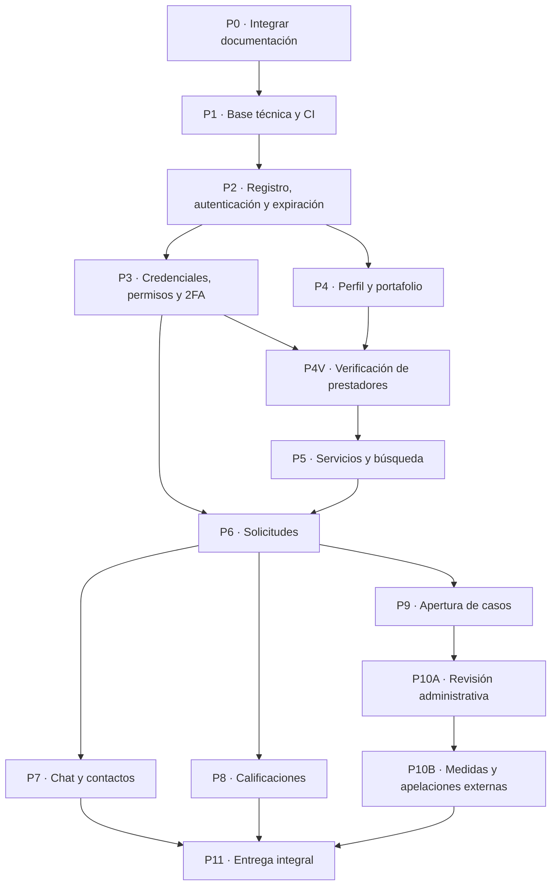

# Plan base de implementación del MVP de Moica


| Dato | Valor |
|---|---|
| Estado | Plan validado para ejecución; verificación manual de prestadores incorporada |
| Fecha de corte | 11 de agosto de 2026 |
| Calendario | Fechas, responsables operativos y plazos se controlan en Trello |
| Repositorio | https://github.com/robertofabiot/moica-hackathon |
| Rama de integración | `develop` |
| Arquitectura | Monolito modular: Spring Boot + React/TypeScript PWA + PostgreSQL |


El diagnóstico del apartado 3 y los estados de ramas y Pull Requests que este documento cita corresponden a esa fecha de corte, el 11 de agosto de 2026, y no se actualizan aquí. El avance real de cada incremento se consulta en `Docs/Dev/MatrizCumplimiento.md` y en los Pull Requests del repositorio.


## 1. Objetivo del plan


Implementar un MVP demostrable de Moica con un historial de Git profesional y trazable. Cada incremento debe aportar comportamiento verificable, no solo archivos aislados: migración de base de datos cuando corresponda, API, interfaz, autorización, validaciones, pruebas y documentación mínima.


La relación recomendada es:


- Un requisito puede necesitar varios commits atómicos.
- Una rama y su Pull Request agrupan una capacidad funcional coherente.
- La matriz de evidencia relaciona cada requisito del entregable con sus PR, commits, pruebas, capturas y documentación.


Por ello, no conviene imponer literalmente “un requisito = un commit”. En 2FA, por ejemplo, separar almacenamiento seguro, activación, verificación por sesión, interfaz y pruebas produce evidencia más clara y permite revisar cada riesgo.


Este documento gobierna el alcance, el orden, las dependencias y los criterios de aceptación. Trello es la fuente de verdad para fechas, asignaciones cotidianas y seguimiento de plazos; no se duplicarán cronogramas dentro de este plan.


## 2. Fuentes de verdad y orden de precedencia


Cuando dos documentos parezcan discrepar, se aplicará este orden:


1. `Docs/Core/DefinicionProducto.md`: alcance y reglas funcionales vigentes.
2. `Docs/Dev/Moica - Diccionario de Datos.xlsx` y `DiagramaLogico.mmd`: estructura, nulabilidad, dominios y restricciones de PostgreSQL.
3. UML de casos de uso, actividades y clases: cobertura de actores, recorridos y responsabilidades.
4. `Docs/Core/prompt.md`: restricciones técnicas del MVP.
5. `Docs/Core/post-mvp.md`: exclusiones expresas.
6. Entregables de preclasificación: criterios que deben quedar demostrados.
7. Marketing y diseño: lenguaje, contenido, identidad, accesibilidad y experiencia visual.


No se programará directamente a partir de `DocumentoBase.md` cuando contradiga la definición consolidada. Como excepción ya resuelta, los entregables aprobados de marketing y diseño fijan una verificación manual de prestadores en dos niveles: `VERIFICADO_BASICO` y `PROFESIONAL_VERIFICADO`. La documentación funcional, el modelo de datos y el código deben respaldar esa promesa sin confundirla con el segundo factor TOTP.


La verificación básica de identidad será necesaria para que un perfil aparezca en el descubrimiento público y active servicios. La verificación profesional será posterior y opcional. El MVP permitirá revisión humana de un expediente documental privado; OCR, biometría, prueba de vida, consultas automáticas a terceros y proveedores externos de verificación quedan post-MVP.


La selección automática de sanciones, los umbrales por reincidencia, el escalamiento automático de severidad y cualquier automatización de cumplimiento normativo también quedan fuera del MVP. Una persona administradora decidirá cada medida. El sistema únicamente registrará la decisión, la hará cumplir y podrá finalizar automáticamente una medida temporal previamente elegida por una persona.


## 3. Diagnóstico del repositorio


| Hallazgo | Estado actual | Consecuencia para el plan |
|---|---|---|
| Ramas | Existen `main`, `develop` y `feature/actualizar-documentacion-mvp`. | La estructura base ya coincide con GitFlow simplificado. |
| Documentación consolidada | El PR #1 integra la rama `feature/actualizar-documentacion-mvp`, pero debe incorporar la verificación de prestadores antes del merge. | Debe completarse, revisarse e integrarse primero a `develop`; todas las ramas de código nacerán después de esa integración y de la promoción documental a `main`. |
| Historial previo | `develop` contiene dos commits que no pasaron por PR y no existen PR anteriores. | No se reescribirá la historia solo para simular evidencia; el cumplimiento estricto comenzará desde el primer PR de código. |
| Conventional Commits | La mayoría cumple, pero existe al menos un `Docs:` con tipo en mayúscula. | Conviene normalizarlo antes del PR solo si nadie más trabaja sobre esa rama; de lo contrario, se registra como excepción histórica y se automatiza la validación futura. |
| Finales de línea | El repositorio mezcla archivos creados desde entornos distintos. | P1 añadirá `.gitattributes` y comprobará la normalización con un diff controlado para evitar PR con archivos completos modificados sin necesidad. |
| Código | `backend/` y `frontend/` solo contienen `.gitkeep`. | El primer incremento técnico debe inicializar ambos proyectos y una prueba de arranque. |
| Automatización | No hay workflows de CI, plantillas de PR ni validación automática. | Deben incorporarse antes de comenzar los módulos funcionales. |
| Infraestructura | `docker-compose.yml` solo levanta PostgreSQL y pgAdmin con credenciales fijas de desarrollo. | Debe externalizar variables y, antes de la entrega, añadirse preparación de producción. |
| README | Describe el concepto y el arranque de la BD, pero no dependencias reales, variables, estructura modular, scripts, endpoints ni despliegue. | Se actualizará incrementalmente y se cerrará en el PR de preparación de entrega. |


## 4. Reglas de control de versiones


### 4.1 Ramas y destino


- `main`: solo versiones presentables. Recibe un PR desde `develop` al cerrar una versión.
- `develop`: integración estable del equipo. No admite commits directos.
- `feature/<descripcion-corta>`: nace de `develop` actualizado y vuelve a `develop` mediante PR.
- `hotfix/<descripcion-corta>`: nace de `main` solo para fallos críticos ya publicados; vuelve mediante PR tanto a `main` como a `develop`.


No hace falta crear ramas personales permanentes ni una rama distinta por cada archivo. Las ramas deben ser breves y asociarse con una tarjeta o issue verificable.


### 4.2 Commits


Formato recomendado:


```text
<tipo>(<alcance>): <acción breve en imperativo>
```


Tipos a admitir en `GIT_WORKFLOW.md`: `feat`, `fix`, `docs`, `refactor`, `test`, `chore`, `ci`, `build`, `style`, `perf` y `revert`.


Alcances orientativos: `repo`, `db`, `backend`, `frontend`, `auth`, `session`, `2fa`, `usuario`, `prestador`, `portafolio`, `verificacion`, `media`, `servicio`, `busqueda`, `solicitud`, `chat`, `calificacion`, `moderacion`, `admin`, `pwa`, `deploy` y `docs`. El alcance es opcional y no se mantendrá una lista cerrada que obligue a usar términos incorrectos.


Reglas:


- Un commit debe dejar el proyecto compilable o explicar claramente por qué es una preparación independiente.
- No mezclar refactorizaciones ajenas con una funcionalidad.
- La migración y el código que depende de ella deben quedar en el mismo PR, aunque sean commits distintos.
- Nunca incluir secretos, `.env` reales, tokens, claves TOTP ni credenciales productivas.
- Los mensajes describen el resultado, no la herramienta usada: `feat(session): rechazar sesiones expiradas`, no `feat: trabajar con Claude`.


### 4.3 Pull Requests y merge


Cada PR debe incluir:


- Objetivo y recorrido funcional afectado.
- Tarjeta o issue relacionado.
- Lista de commits o decisiones importantes.
- Cambios de base de datos y procedimiento de migración.
- Matriz breve de autorización: quién puede y quién no puede ejecutar la acción.
- Pruebas realizadas y comandos reproducibles.
- Capturas en teléfono, tableta y escritorio cuando cambie la interfaz.
- Variables de entorno nuevas, sin valores secretos.
- Riesgos o trabajo pendiente, sin ocultarlo dentro del código.


Requisitos de GitHub para `develop` y `main`:


- PR obligatorio y al menos una aprobación del otro desarrollador.
- Checks de CI obligatorios y conversaciones resueltas.
- Invalidar aprobaciones cuando el autor suba cambios importantes.
- Prohibir force-push y eliminación de ramas protegidas.
- Borrar la rama `feature/` después del merge.


Para conservar los commits atómicos y demostrar la convergencia de ramas, se recomienda merge commit desde el PR, editando su mensaje al formato convencional, por ejemplo `feat(solicitud): implementar ciclo de solicitudes (#12)`. No se recomienda squash como estrategia general porque ocultaría del historial principal los checkpoints que se desean presentar como evidencia.


## 5. Arquitectura de implementación


### 5.1 Backend


El backend seguirá un monolito modular. Cada módulo de dominio contiene sus capas clásicas `controller`, `service`, `repository`, `entity` y `dto`, sin introducir arquitectura hexagonal ni microservicios.


Módulos previstos:


- `auth` y `usuario`
- `prestador`, `portafolio` y `verificacion`
- `servicio` y `catalogo`
- `solicitud` y `chat`
- `calificacion`
- `moderacion` y `admin`
- `comun` para errores, seguridad, auditoría y utilidades compartidas


Todas las entradas externas se reciben mediante DTO validados. Las entidades JPA no se exponen directamente. Los errores se devuelven con un formato uniforme y sin trazas ni datos sensibles.


### 5.2 Base de datos


Todas las entidades, valores de dominio, claves, checks y relaciones de la versión del diccionario integrada en P0 se implementarán mediante migraciones versionadas. Flyway queda aprobado como mecanismo de migraciones versionadas. No se conservarán los conteos anteriores porque P0 añade el expediente de verificación.


Flyway no es una función visible de Moica: es el mecanismo que permite crear y actualizar el mismo esquema de PostgreSQL en cada computadora, en CI y en producción. También convierte el diseño de base de datos en evidencia ejecutable y auditable.


Para evitar choques entre ramas se reservarán rangos de migración:


- `V1–V9`: extensiones, dominios y base común.
- `V10–V19`: identidad, autenticación y sesiones.
- `V20–V29`: territorio, perfiles y portafolio.
- `V30–V39`: verificación de prestadores, archivos privados, servicios y catálogos.
- `V40–V49`: solicitudes, mensajes y calificaciones.
- `V50–V59`: moderación, medidas e historial SCD2.
- `V90–V99`: catálogos y datos de demostración aprobados.


Los dominios controlados se implementarán como `VARCHAR` con restricciones `CHECK`, manteniendo enums en Java para la capa de aplicación; no se crearán tipos enum nativos de PostgreSQL. Las pruebas de persistencia deben ejecutarse contra PostgreSQL real mediante Testcontainers o un entorno equivalente; H2 no demuestra correctamente checks, índices parciales ni la exclusión temporal de `HistorialCaso`.


### 5.3 Frontend


El frontend se organizará por capacidades, utilizando React + TypeScript, React Query para datos remotos, Zustand solo para estado global real, CSS Modules y enfoque mobile-first. La PWA será instalable, responsiva y tendrá un estado de sesión vencida comprensible.


No se implementarán WebSockets: el chat usará short polling con `refetchInterval`. Tampoco se incorporarán Tailwind, MUI, Bootstrap, mapas, pagos, multimedia en chat ni otras funciones declaradas post-MVP.


### 5.4 Decisiones transversales de seguridad y despliegue


- En producción, frontend y API se publicarán bajo un mismo origen. Durante desarrollo, Vite utilizará un proxy hacia Spring Boot. El proveedor final podrá elegirse en P11 sin cambiar este contrato.
- El JWT se transportará en una cookie `HttpOnly`, `Secure` en producción y `SameSite=Lax`; no se almacenará en `localStorage` ni `sessionStorage`.
- Las operaciones mutables conservarán protección CSRF compatible con autenticación por cookie.
- Cada sesión durará inicialmente siete días, mediante una propiedad configurable. El MVP no tendrá renovación automática ni refresh token: al expirar, la persona vuelve a iniciar sesión.
- La validez se comprobará contra la fila `Sesion` en cada petición autenticada. Cierre de sesión, cambio de credenciales y medidas administrativas aplicables revocarán el acceso en la siguiente petición.
- El despliegue se preparará con contenedores y variables de entorno; ninguna decisión de proveedor debe quedar acoplada al código.


## 6. Secuencia de integración





## 7. Incrementos, ramas y commits esperados


Los mensajes siguientes son checkpoints previstos, no una obligación de copiar literalmente. Se pueden dividir cuando un cambio siga siendo demasiado grande, pero no deben mezclarse funcionalidades independientes.


### P0. Cerrar e integrar la documentación vigente


- Rama existente: `feature/actualizar-documentacion-mvp`.
- Estado comprobado al 11 de agosto de 2026: PR #1 abierto hacia `develop`; debe completarse antes del merge.
- Responsable: autor de la rama; revisión cruzada de Erving/Roberto.
- Acciones:
  1. Incorporar únicamente las decisiones funcionales ya aprobadas que todavía no estén expresas: moderación manual, apelaciones por canal externo, una sola medida vigente por cuenta y automatización normativa/reincidencia como post-MVP.
  2. Mantener la política documental vigente de contactos ocultos hasta la aceptación mientras el equipo no apruebe expresamente un cambio.
  3. Incorporar la verificación manual de prestadores en dos niveles y proteger el expediente documental como información privada.
  4. Alinear README, definición funcional, diccionario, modelos conceptual y lógico y UML con ese flujo, sin modificar los entregables aprobados de marketing o diseño.
  5. Ampliar `GIT_WORKFLOW.md` con los tipos convencionales aprobados, el scope opcional y la promoción de hitos mediante PR de `develop` a `main`.
  6. Revisar el diff completo, actualizar el PR #1 y esperar aprobación; no realizar merge directo.
- Commits orientativos:
  - `docs(producto): aclarar moderación manual y apelaciones externas`
  - `docs(post-mvp): posponer automatización normativa y reincidencia`
  - `docs(producto): incorporar verificacion de prestadores al mvp`
  - `docs(db): modelar solicitudes y documentos de verificacion`
  - `docs(uml): incorporar flujo de verificacion de prestadores`
  - `docs(git): completar convenciones de commits y pull requests`
- Criterio de salida: `develop` contiene la definición funcional, el diccionario y los tres UML alineados con autenticación, verificación de prestadores y moderación; después se promueve esta línea base mediante PR a `main`. La rama se elimina después del merge y ninguna rama de código nace antes de cerrar ambos PR documentales.


### P1. Preparar repositorio, aplicaciones y CI


- Rama: `feature/preparar-base-tecnica`, creada únicamente desde `develop` después de P0.
- Trabajo conjunto: Roberto inicializa backend; Erving inicializa frontend/PWA; ambos validan el arranque integrado.
- Commits orientativos:
  - `chore(repo): definir finales de línea y archivos ignorados`
  - `docs(repo): agregar plantilla de pull request y matriz de cumplimiento`
  - `chore(repo): agregar archivo de entorno de ejemplo`
  - `chore(backend): inicializar aplicación Spring Boot`
  - `chore(frontend): inicializar aplicación React con TypeScript`
  - `feat(backend): exponer verificación básica de salud`
  - `chore(db): integrar Flyway con PostgreSQL`
  - `ci(repo): validar commits y títulos convencionales`
  - `ci(repo): validar compilación y pruebas de frontend y backend`
  - `test(smoke): verificar arranque integrado del monorepo`
  - `docs(readme): documentar arranque de la base técnica`
- Criterio de salida: una instalación limpia puede levantar PostgreSQL, backend y frontend; CI compila y prueba ambos; `.gitattributes` evita cambios espurios; `Docs/Dev/MatrizCumplimiento.md` enlaza los criterios del entregable con evidencia prevista; no existen secretos versionados.


### P2. Registro, inicio de sesión y ciclo básico de sesión


- Rama: `feature/autenticacion-base`.
- Lidera Roberto; Erving implementa formularios y estados de interfaz.
- Política inicial: contraseña de 8 a 72 caracteres, con al menos una mayúscula, una minúscula, un número y un símbolo. “Alternar” no significa que cada carácter deba cambiar de tipo.
- Commits orientativos:
  - `feat(db): crear esquema de usuarios y sesiones`
  - `feat(auth): registrar cuentas con contraseña hasheada`
  - `feat(auth): autenticar credenciales y crear sesión expirable`
  - `feat(auth): emitir jwt de sesión mediante cookie segura`
  - `feat(session): rechazar sesiones expiradas`
  - `feat(session): revocar la sesión al cerrar sesión`
  - `feat(frontend): implementar registro e inicio de sesión`
  - `feat(frontend): gestionar expiración y cierre de sesión`
  - `feat(backend): uniformar validaciones y respuestas de error`
  - `test(auth): cubrir registro, credenciales, expiración y entradas inválidas`
- Criterio de salida: registro e inicio funcionan de extremo a extremo; la contraseña nunca se almacena ni registra en texto claro; cada login crea una fila `Sesion` con expiración configurable de siete días; la siguiente petición rechaza una sesión expirada o cerrada.


### P3. Cambio de credenciales, permisos y TOTP


- Rama: `feature/seguridad-permisos-2fa`.
- Lidera Roberto; Erving implementa cambio de contraseña, configuración TOTP y estados de acceso.
- El cambio de contraseña exige la contraseña actual, revoca todas las sesiones con motivo `CAMBIO_CREDENCIALES` y obliga a iniciar sesión de nuevo. La recuperación de contraseña queda fuera del MVP.
- Commits orientativos:
  - `feat(auth): cambiar contraseña y revocar sesiones activas`
  - `feat(authz): aplicar políticas de cuenta, rol y propiedad`
  - `feat(2fa): registrar y activar un segundo factor totp`
  - `feat(2fa): verificar el segundo factor por sesión`
  - `feat(2fa): impedir acceso administrativo sin segundo factor verificado`
  - `feat(frontend): gestionar contraseña, segundo factor y accesos denegados`
  - `test(security): demostrar revocación, permisos y 2fa`
- Criterio de salida: la contraseña crea una sesión provisional cuando la cuenta tiene TOTP activo y el código correcto la completa; una revocación afecta la siguiente petición; `/admin` exige simultáneamente rol administrativo y TOTP verificado.


### P4. Catálogos territoriales, perfil, contactos y portafolio


- Rama: `feature/perfil-portafolio`
- Lidera Erving; Roberto revisa propiedad de recursos y estados de cuenta.
- Commits orientativos:
  - `feat(db): crear territorio, perfil, contactos y portafolio`
  - `feat(db): cargar municipios habilitados de Managua`
  - `feat(prestador): crear y actualizar el perfil propio`
  - `feat(prestador): gestionar disponibilidad y contactos externos`
  - `feat(portafolio): gestionar trabajos e imágenes del perfil`
  - `feat(media): validar y almacenar imágenes de perfil y portafolio`
  - `feat(frontend): construir perfil y portafolio responsivos`
  - `test(prestador): cubrir propiedad, disponibilidad y validaciones`
- Criterio de salida: un usuario crea como máximo un perfil, administra solo sus datos y puede alternar entre disponible/no disponible. El perfil puede prepararse mientras permanece `SIN_VERIFICAR`, pero todavía no aparece en el descubrimiento público ni admite servicios activos. Los contactos se mantienen ocultos hasta que una solicitud sea aceptada, salvo que el equipo apruebe y documente otro criterio antes de iniciar P4.


### P4V. Verificación manual de prestadores


- Rama: `feature/verificacion-prestadores`.
- Depende de P3 para el acceso administrativo con TOTP y de P4 para la existencia del perfil.
- Roberto lidera el modelo, almacenamiento privado, autorización y revisión administrativa; Erving implementa la solicitud, consulta de estado, cola administrativa e insignias responsivas.
- Alcance:
  - Nivel inicial `SIN_VERIFICAR`.
  - Verificación básica de identidad, necesaria para publicar el perfil y activar servicios.
  - Verificación profesional opcional, disponible únicamente después de la básica.
  - Expediente documental privado con revisión humana; sin OCR, biometría ni proveedores externos.
  - Rechazo, reenvío y revocación manual con motivo.
- Commits orientativos:
  - `feat(db): crear solicitudes y documentos de verificacion`
  - `feat(verificacion): enviar expediente documental privado`
  - `feat(verificacion): consultar estado de la solicitud propia`
  - `feat(admin): revisar solicitudes de verificacion`
  - `feat(prestador): aplicar nivel y visibilidad de verificacion`
  - `feat(frontend): implementar solicitud y estado de verificacion`
  - `feat(frontend): mostrar insignias de verificacion`
  - `test(verificacion): cubrir niveles permisos archivos y rechazos`
  - `docs(verificacion): documentar flujo y alcance de insignias`
- Criterio de salida: un prestador sin verificación puede preparar su perfil, pero no aparecer públicamente ni activar servicios; un administrador con TOTP revisa documentos privados y puede aprobar, rechazar o revocar; la aprobación básica habilita visibilidad y la profesional agrega una insignia superior; ningún visitante puede acceder al expediente ni a identificadores sensibles.


### P5. Servicios publicados y descubrimiento público


- Rama: `feature/servicios-busqueda-publica`
- Lidera Erving; Roberto revisa consultas, seguridad de escritura e integridad.
- Commits orientativos:
  - `feat(db): crear categorías, subcategorías y servicios publicados`
  - `feat(db): cargar taxonomía aprobada de servicios`
  - `feat(servicio): gestionar publicaciones e imágenes propias`
  - `feat(media): validar y almacenar imágenes de servicios`
  - `feat(busqueda): filtrar servicios por texto, categoría y municipio`
  - `feat(busqueda): exponer perfiles y servicios para navegación pública`
  - `feat(frontend): implementar búsqueda y detalle responsivos`
  - `test(servicio): cubrir estado, propiedad y disponibilidad`
- Criterio de salida: un visitante explora sin autenticarse; solo servicios activos de prestadores disponibles y al menos `VERIFICADO_BASICO` aparecen habilitados para contratación; el nivel de verificación se muestra con una explicación que no garantiza la calidad del trabajo. Un precio nulo se muestra como “A convenir”. La migración de demostración carga tres categorías iniciales con pocas subcategorías, sin presentar esa taxonomía como exhaustiva.


### P6. Ciclo e historial de solicitudes


- Rama: `feature/solicitudes-servicio`
- Lidera Roberto; Erving desarrolla formulario, bandejas y estados visuales.
- Commits orientativos:
  - `feat(db): crear solicitudes e historial de estados`
  - `feat(solicitud): enviar solicitudes válidas a servicios ajenos`
  - `feat(solicitud): aceptar o rechazar como prestador destinatario`
  - `feat(solicitud): cancelar según actor y estado`
  - `feat(solicitud): completar como prestador y registrar historial`
  - `feat(frontend): implementar formulario y bandejas de solicitudes`
  - `test(solicitud): cubrir actores, estados finales y motivos`
- Criterio de salida: todas las transiciones del documento funcional se ejecutan en transacciones y producen `CambioEstadoSolicitud`; auto-solicitud, servicio inactivo y prestador no disponible son rechazados.


### P7. Chat de texto y revelación de contactos


- Rama: `feature/chat-contactos`
- Roberto implementa API/autorización; Erving implementa experiencia de chat.
- Commits orientativos:
  - `feat(db): crear mensajes asociados a solicitudes`
  - `feat(chat): autorizar lectura y envío entre participantes`
  - `feat(chat): bloquear mensajes fuera del estado aceptada`
  - `feat(frontend): implementar short polling del chat`
  - `feat(frontend): revelar contactos después de la aceptación`
  - `test(chat): cubrir privacidad, participantes y cierre`
- Criterio de salida: solo los dos participantes acceden al hilo; el envío se habilita únicamente en `ACEPTADA`; al cancelar o completar, el historial queda en solo lectura.


### P8. Calificaciones y reputación por rol


- Rama: `feature/calificaciones-reputacion`
- Lidera Erving; Roberto revisa participación y unicidad.
- Commits orientativos:
  - `feat(db): crear calificaciones y restricciones de unicidad`
  - `feat(calificacion): registrar valoración después de completar`
  - `feat(calificacion): calcular reputación separada por rol`
  - `feat(frontend): implementar calificación opcional y reputación`
  - `test(calificacion): cubrir puntuación, participantes y duplicados`
- Criterio de salida: cada parte puede calificar una vez, solo a la contraparte y únicamente después de completar; no calificar no penaliza.


### P9. Reporte y apertura de casos de moderación


- Rama: `feature/casos-moderacion`.
- Roberto implementa expediente e historial; Erving implementa el reporte del participante.
- Commits orientativos:
  - `feat(db): crear casos, medidas e historial scd2`
  - `feat(db): proteger vigencias scd2 con exclusion temporal`
  - `feat(moderacion): abrir caso entre participantes válidos`
  - `feat(moderacion): crear la versión histórica inicial del caso`
  - `feat(frontend): implementar reporte y consulta del caso propio`
  - `test(moderacion): cubrir participantes, duplicados y versión inicial`
- Criterio de salida: reportar no cambia la solicitud, no selecciona una medida y no sanciona automáticamente la cuenta; cada participante abre como máximo un caso por solicitud aceptada; la primera versión SCD2 se crea en la misma transacción.


### P10A. Revisión y resolución administrativa


- Rama: `feature/admin-casos-moderacion`.
- Lidera Roberto; Erving revisa navegación, mensajes de estado y consistencia visual.
- Commits orientativos:
  - `feat(admin): consultar solicitudes, mensajes y evidencias de casos`
  - `feat(admin): asignar y reasignar casos`
  - `feat(admin): cambiar estados y registrar resoluciones`
  - `feat(moderacion): versionar cambios del caso en una transacción`
  - `feat(frontend): implementar navegación independiente de admin`
  - `test(admin): cubrir 2fa, permisos, resoluciones y scd2`
- Criterio de salida: ninguna lectura o escritura administrativa se ejecuta sin rol + TOTP; el acceso al chat solo ocurre dentro de un caso relacionado; cada cambio conserva una sola versión vigente sin periodos superpuestos.


### P10B. Catálogo de medidas, aplicación manual y apelaciones externas


- Rama: `feature/admin-medidas-moderacion`.
- Lidera Roberto; Erving implementa confirmaciones, avisos de restricción y estados visuales.
- Commits orientativos:
  - `feat(admin): gestionar catálogo de medidas administrativas`
  - `feat(admin): aplicar revocar o reemplazar medidas manualmente`
  - `feat(admin): confirmar reemplazo de una medida vigente`
  - `feat(admin): actualizar cuenta y revocar sesiones afectadas`
  - `feat(admin): registrar apelaciones recibidas por canal externo`
  - `feat(admin): aceptar o rechazar apelaciones registradas`
  - `feat(moderacion): expirar medidas temporales de forma segura`
  - `feat(frontend): mostrar medida vigente y canal de soporte`
  - `test(admin): cubrir catálogo medida única apelaciones y expiración`
- Criterio de salida: una persona administradora elige cada medida; el sistema nunca recomienda ni escala sanciones por reincidencia. Cada cuenta tiene como máximo una medida vigente. Si existe otra, la API responde conflicto y exige confirmación explícita para revocarla y sustituirla de forma transaccional. Al expirar o revocarse la única medida, la cuenta vuelve a `ACTIVA`. Las medidas referenciadas se deshabilitan en lugar de borrarse físicamente. La apelación se recibe fuera de Moica y el administrador registra su resultado.


### P11. Validación integral, producción y entrega


- Rama: `feature/preparar-entrega-mvp`
- Trabajo conjunto y revisión de Leslie para UI; marketing valida textos y promesas.
- Commits orientativos:
  - `test(e2e): automatizar el recorrido principal del mvp`
  - `test(e2e): automatizar expiración 2fa verificación y moderación`
  - `fix(a11y): corregir contraste, foco, etiquetas y textos alternativos`
  - `feat(pwa): completar instalación y adaptación responsiva`
  - `build(deploy): crear imágenes reproducibles de frontend y backend`
  - `chore(deploy): externalizar configuración de producción`
  - `docs(api): documentar endpoints y ejemplos de uso`
  - `docs(readme): documentar arquitectura, dependencias, entorno y scripts`
  - `docs(deploy): documentar migración, despliegue y verificación`
- Criterio de salida: CI verde desde una instalación limpia; recorridos P2–P10B, incluido P4V, aprobados; README cumple el entregable; artefactos de producción reproducibles; capturas y evidencias reunidas; la matriz de cumplimiento enlaza PR, prueba y evidencia final de cada criterio.


Después, se abre un PR de `develop` hacia `main` con título `chore(release): publicar mvp de preclasificación`, se ejecuta nuevamente la validación completa y se crea una etiqueta como `v0.1.0-mvp`.


## 8. Matriz mínima de permisos


| Acción | Visitante | Usuario autenticado | Regla adicional |
|---|---:|---:|---|
| Explorar perfiles, servicios, categorías, insignias y reputación pública | Sí | Sí | Solo perfiles con verificación básica vigente; los contactos permanecen ocultos hasta la aceptación. |
| Crear/editar perfil, contactos y portafolio | No | Sí | Solo propietario; cuenta `ACTIVA`; puede prepararse sin verificación. |
| Activar servicios y aparecer en búsqueda | No | Sí | Solo propietario; cuenta `ACTIVA`, prestador disponible y al menos `VERIFICADO_BASICO`. |
| Enviar expediente de verificación | No | Sí | Solo propietario de `PerfilPrestador`; una solicitud abierta por nivel; profesional exige básica vigente. |
| Consultar solicitud y documentos propios | No | Sí | Solo propietario; archivos entregados mediante autorización temporal. |
| Revisar verificaciones y documentos privados | No | No | Solo administrador con TOTP verificado; aprobación, rechazo o revocación manual. |
| Enviar solicitud | No | Sí | Cuenta `ACTIVA`; servicio ajeno y activo; prestador disponible. |
| Aceptar/rechazar/completar | No | Sí | Cuenta `ACTIVA`; solo prestador destinatario y transición válida. |
| Cancelar | No | Sí | Participante autorizado; también se permite a una cuenta restringida para cerrar compromisos existentes. |
| Leer/enviar chat | No | Sí | Solo participantes; lectura si llegó a aceptarse; envío únicamente en `ACEPTADA` y con cuenta `ACTIVA`. |
| Ver contactos | No | Sí | Solo cliente participante después de aceptación, según la política funcional vigente. |
| Calificar | No | Sí | Cuenta `ACTIVA`; solicitud completada, una vez por contraparte. |
| Reportar | No | Sí | Participante desde una solicitud que llegó a estar aceptada; se conserva aun con restricción temporal. |
| Consultar los mensajes relacionados con un caso | No | No | Solo administrador con TOTP, dentro del expediente correspondiente. |
| Consultar y resolver todos los casos | No | No | Solo administrador con TOTP verificado en la sesión. |
| Gestionar y aplicar medidas | No | No | Solo administrador con TOTP; catálogo habilitado y confirmación de reemplazo cuando exista una medida. |


### 8.1 Efectos iniciales de los estados de cuenta


| Estado | Acciones permitidas | Acciones bloqueadas |
|---|---|---|
| `ACTIVA` | Todas las autorizadas por rol, propiedad y estado del recurso. | Ninguna adicional. |
| `RESTRINGIDA_TEMPORAL` | Navegación pública, consulta de historial propio, gestión de seguridad, cierre de sesión, cancelación de compromisos existentes y apertura/consulta de casos propios. | Crear o modificar perfil, portafolio o servicios; iniciar, aceptar o completar solicitudes; enviar mensajes; calificar. |
| `SUSPENDIDA_TEMPORAL` | Consultar el aviso de suspensión y canal de soporte; navegar como visitante. | Todas las acciones autenticadas de negocio hasta `fechaFinEstadoCuenta`. |
| `SUSPENDIDA_PERMANENTE` | Consultar el aviso y canal de soporte; navegar como visitante. | Todas las acciones autenticadas de negocio sin reactivación automática. |


Los administradores crean, editan y deshabilitan medidas, seleccionando el estado de cuenta resultante y si requiere fecha final. En el MVP, los efectos de cada `EstadoCuenta` son una política fija; no se añadirá un motor dinámico de permisos por medida. La autorización siempre se aplica en backend. Ocultar un botón en React mejora la experiencia, pero no constituye un control de seguridad.


## 9. Evidencia para cada requisito del entregable avanzado


| Requisito | Evidencia prevista |
|---|---|
| README técnico completo | README final, `.env.example`, árbol modular, dependencias, scripts, comandos de ejecución, ejemplos de endpoints y enlace a documentación API. |
| ER 3FN y tres UML completos | Documentación integrada mediante P0; migraciones y pruebas de restricciones alineadas con el diccionario y el modelo lógico. |
| Interfaz navegable, validada y responsiva | Recorrido completo, validaciones visibles, capturas en tres tamaños, pruebas de formularios y revisión de accesibilidad. |
| Ramas, Conventional Commits, PR y trazabilidad | Protección de ramas, PR numerados, commits atómicos preservados, aprobación cruzada, CI obligatorio, tarjetas enlazadas y etiqueta de versión. |
| Matriz de cumplimiento | `Docs/Dev/MatrizCumplimiento.md` creada en P1 y actualizada en cada PR con requisito, commit/PR, prueba y evidencia. |
| Validación de entradas y manejo de errores | DTO con Bean Validation, validación de formularios, manejador global, respuestas uniformes y pruebas negativas. |
| Protección de rutas y datos | Matriz de permisos, pruebas 401/403, propiedad, estados de cuenta, filtros de datos y revisión de contactos, chat y expedientes documentales privados. |
| Verificación de prestadores | PR P4V, expediente privado, dos niveles manuales, cola administrativa, insignias públicas y pruebas de visibilidad y acceso no autorizado. |
| Autenticación de dos factores | PR P3, configuración TOTP, secreto cifrado, verificación por sesión y prueba de `/admin` bloqueado/habilitado. |
| Expiración de sesión | PR P2, `fechaExpiracion`, rechazo persistente, respuesta 401, interfaz de sesión vencida y prueba con reloj controlado. |
| Preparación para producción | Dockerfiles, mismo origen, configuración por entorno, migraciones controladas, healthcheck, build reproducible, guía de despliegue y URL si se publica. |


Para la presentación conviene conservar una carpeta de evidencias fuera del código fuente o una sección de la documentación con enlaces a PR, capturas, resultados de CI y guiones de prueba. No se deben fabricar capturas al final: cada PR de interfaz debe aportar las suyas.


## 10. Recorridos de aceptación


### Recorrido funcional principal


1. Usuario A se registra, inicia sesión y crea perfil, contactos y portafolio; todavía no aparece públicamente.
2. A envía su expediente básico. Un administrador con TOTP lo revisa y lo aprueba; el perfil muestra `VERIFICADO_BASICO` y puede activar un servicio.
3. De forma opcional, A presenta respaldo profesional y obtiene `PROFESIONAL_VERIFICADO` sin que la insignia garantice la calidad futura del trabajo.
4. Usuario B descubre el servicio públicamente, inicia sesión y envía una solicitud.
5. A acepta; B puede ver contactos y ambos conversan.
6. A completa; el chat queda en solo lectura.
7. A y B pueden calificarse de forma opcional y la reputación se actualiza por rol.


### Recorrido de seguridad


1. Una sesión expirada recibe 401 y la interfaz solicita autenticación nueva.
2. Cerrar sesión revoca el acceso en la siguiente petición aunque el JWT conserve una expiración futura.
3. Cambiar la contraseña revoca todas las sesiones y exige autenticarse nuevamente.
4. Un usuario normal recibe 403 al intentar `/admin`.
5. Un administrador sin TOTP verificado recibe 403; tras verificarlo accede con esa sesión.
6. Un usuario no propietario no puede editar perfil/servicio ni leer solicitudes/chat ajenos.
7. Una cuenta restringida o suspendida recibe el comportamiento exacto de la matriz 8.1.
8. Un visitante, otro usuario o un administrador sin TOTP no puede abrir documentos de verificación; las respuestas no exponen claves de almacenamiento ni números de identidad.


### Recorrido de moderación


1. Desde una solicitud aceptada, un participante reporta a la contraparte.
2. El caso nace `ABIERTO` con versión SCD2 número 1 y sin sanción automática.
3. El administrador con 2FA se asigna el caso, revisa evidencia y lo cierra como procedente o desestimado.
4. Si decide aplicar una medida, el sistema comprueba si ya existe una vigente. Si existe, exige confirmación para sustituirla y registra revocación y aplicación dentro de una operación consistente.
5. La cuenta refleja la medida, las sesiones afectadas se revocan y el historial conserva todas las decisiones.
6. Si la persona apela por el canal externo indicado, un administrador registra la apelación y puede aceptarla, rechazarla o reabrir el mismo expediente.
7. El vencimiento automático solo finaliza una medida temporal previamente impuesta por una persona; nunca decide una sanción nueva.


## 11. Decisiones consolidadas y parámetros delegados


| ID | Decisión vigente | Momento de aplicación |
|---|---|---|
| D-SEC-01 | Sesión de siete días, configurable, sin renovación automática; cookie segura, mismo origen y comprobación persistente por petición. | P1–P2 |
| D-SEC-02 | Contraseña de 8–72 caracteres con mayúscula, minúscula, número y símbolo. Cambiarla exige la contraseña actual y revoca todas las sesiones. Recuperación de contraseña queda fuera del MVP. | P2–P3 |
| D-MOD-01 | Todas las medidas son elegidas por una persona administradora. Reincidencia, umbrales, recomendación y escalamiento automáticos quedan post-MVP y aún no se definen. | P0, P9–P10B |
| D-MOD-02 | Los administradores gestionan el catálogo de medidas; “borrar” significa deshabilitar si existe historial. Las acciones bloqueadas se derivan de una política fija por `EstadoCuenta`, no de un motor dinámico. | P10B |
| D-MOD-03 | Cada cuenta puede tener una sola medida vigente. Una segunda aplicación exige advertencia y confirmación explícita de sustitución; al revocar o expirar vuelve a `ACTIVA`. | P10B |
| D-MOD-04 | La apelación se presenta por un canal externo mostrado en la aplicación. No existe formulario de apelación para el usuario; el administrador registra y resuelve lo recibido. | P10B |
| D-MEDIA-01 | La API recibe imágenes públicas multipart, valida JPEG/PNG/WebP y un máximo inicial de 5 MB, delega el almacenamiento a un servicio configurable y persiste solo la URL. El proveedor concreto se elige antes de P4 según el despliegue. | Antes de P4 |
| D-MEDIA-02 | Los expedientes de verificación admiten JPEG, PNG o PDF de hasta 5 MB por archivo, usan almacenamiento privado y persisten una clave opaca y metadatos, nunca una URL pública permanente. | P4V |
| D-ADM-01 | El primer administrador será una cuenta ordinaria existente promovida mediante un bootstrap idempotente configurado por entorno; no habrá registro público, contraseña fija ni secreto versionado. Después deberá activar TOTP. | P3, antes de P4V |
| D-CAT-01 | Los datos de demostración incluirán tres categorías con pocas subcategorías, versionadas por migración y claramente ampliables. La taxonomía completa no bloquea el MVP. | P5 |
| D-DEP-01 | La arquitectura de despliegue será Docker y mismo origen. El proveedor se decidirá en P11 y se documentará según lo realmente utilizado. | P1 y P11 |
| D-VER-01 | La verificación pertenece al perfil de prestador y tiene niveles `SIN_VERIFICAR`, `VERIFICADO_BASICO` y `PROFESIONAL_VERIFICADO`; la básica habilita visibilidad y servicios, y la profesional es posterior y opcional. | P0, P4V–P5 |
| D-VER-02 | La revisión del expediente es manual por un administrador con TOTP. OCR, biometría, prueba de vida, consultas automáticas a terceros y proveedores externos quedan post-MVP. | P0, P4V y P11 |
| D-VER-03 | Una insignia confirma revisión documental, no calidad futura. Rechazos pueden reenviarse; revocar la básica oculta el perfil y bloquea nuevas solicitudes sin cancelar compromisos ya aceptados. | P4V–P6 |
| D-CON-01 | Mientras no exista una aprobación expresa distinta, prevalece la regla consolidada: los contactos externos permanecen ocultos hasta que la solicitud sea aceptada. Un cambio requiere actualizar documentación, P4 y P7 antes de implementarlo. | Antes de P4 |


Taxonomía de demostración propuesta:


- Hogar y mantenimiento: plomería, electricidad y carpintería.
- Belleza y cuidado personal: maquillaje, barbería/peluquería y uñas.
- Tecnología y servicios digitales: reparación de computadoras, diseño gráfico y soporte técnico.


Estas semillas prueban la estructura; no constituyen una clasificación definitiva del mercado.


## 12. Dependencias aprobadas y regla de incorporación


Lista mínima aprobada:


- Backend: Spring Web, Spring Data JPA, Spring Security, Bean Validation, Spring Boot Actuator, PostgreSQL Driver, Flyway, una biblioteca JWT mantenida y una biblioteca TOTP mantenida.
- Pruebas backend: Spring Boot Test y Testcontainers PostgreSQL.
- Frontend: React Router, TanStack React Query, soporte PWA de Vite y Zustand únicamente cuando exista estado global real.
- Formularios: React Hook Form + Zod para los formularios con reglas sustanciales.
- Pruebas frontend: Vitest + React Testing Library; Playwright para los recorridos críticos.
- Documentación API: OpenAPI/Springdoc.
- Archivos: SDK del proveedor seleccionado en P4, aislado detrás de un servicio de almacenamiento que separe recursos públicos de expedientes privados y entregue estos últimos solo mediante acceso temporal autorizado.


Cada dependencia debe tener una función concreta en el mismo PR que la incorpora, quedar fijada mediante archivos de bloqueo o configuración reproducible y registrarse en el README. No se introducirán generadores, frameworks visuales, brokers, cachés distribuidas ni infraestructura que no resuelva un requisito aprobado.


## 13. Definition of Done común


Un PR funcional solo está listo cuando:


- Parte de `develop` actualizado y no incluye cambios ajenos.
- Implementa base de datos/API/interfaz necesarias para el incremento o justifica expresamente la excepción.
- Valida entradas en frontend y backend.
- Aplica autenticación, estado de cuenta, propiedad y rol en backend.
- Incluye pruebas positivas y negativas relevantes.
- No expone entidades, secretos, claves TOTP, hashes, documentos de identidad, claves privadas de almacenamiento ni trazas sensibles.
- Actualiza variables, comandos, endpoints o decisiones documentales afectados.
- Actualiza la fila correspondiente de `Docs/Dev/MatrizCumplimiento.md`.
- Incluye capturas cuando cambia UI y verifica teléfono, tableta y escritorio.
- CI está verde, el otro desarrollador aprobó y todas las conversaciones están resueltas.


## 14. Modo de ejecución con Claude


Claude trabajará un incremento o subincremento por vez. Cada prompt deberá:


1. Indicar la rama base y comprobar que el PR anterior ya fue integrado en `develop`.
2. Limitar el alcance al incremento indicado y prohibir funciones post-MVP o refactorizaciones ajenas.
3. Pedir inspección previa de documentación y estado real del repositorio.
4. Exigir commits atómicos convencionales, pruebas reproducibles y actualización de la matriz de cumplimiento.
5. Solicitar push de la rama y PR hacia `develop`, pero prohibir el merge directo.
6. Pedir un informe final con archivos, commits, pruebas, decisiones técnicas y pendientes reales.
7. Detenerse y consultar únicamente cuando una ambigüedad obligue a cambiar alcance, modelo de datos o seguridad aprobada.


El equipo revisará y aprobará cada PR antes de entregar el siguiente prompt. El plan ya fue validado; Claude no debe sustituirlo por otra arquitectura ni reabrir decisiones cerradas sin una contradicción documental concreta.


Este documento autoriza la ejecución ordenada del plan, no la ampliación silenciosa del MVP.
