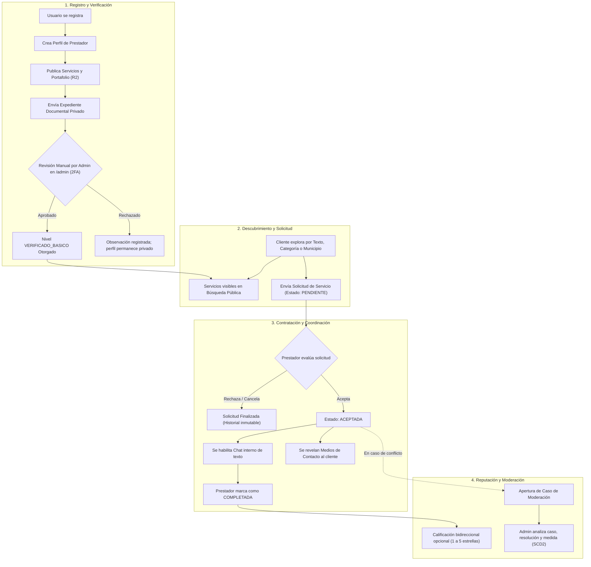
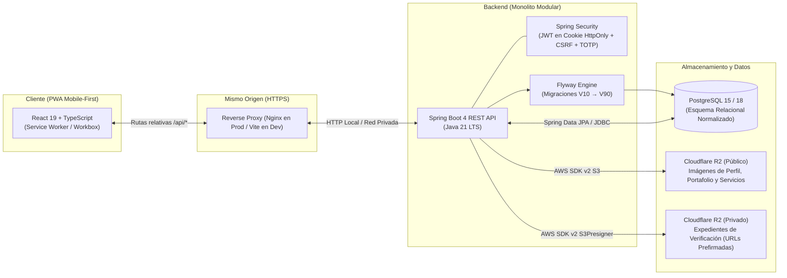

<div align="center">
  

# MOICA

**La confianza se construye entre todos.**

*Hackathon Nicaragua 2026 — Categoría Avanzado · Reto Conecta Emprende · Universidad Americana (UAM) · Equipo Nova Studios*

[](LICENSE)
[](backend/pom.xml)
[](backend/pom.xml)
[](frontend/package.json)
[](frontend/package.json)
[](docker-compose.yml)
[-F38020?logo=cloudflare&logoColor=white)](Docs/Dev/Almacenamiento.md)
[](docker-compose.yml)
[](frontend/vite.config.ts)
[](https://frontend-production-90df.up.railway.app)
[](backend/pom.xml)

</div>

---

## Tabla de contenidos

1. [Descripción](#descripción)
   - [Qué es MOICA](#qué-es-moica)
   - [Problema que resuelve](#problema-que-resuelve)
   - [Alcance real del MVP](#alcance-real-del-mvp)
   - [Principales actores](#principales-actores)
   - [Recorrido funcional resumido](#recorrido-funcional-resumido)
2. [Arquitectura](#arquitectura)
   - [Visión general](#visión-general)
   - [Principios y decisiones de diseño](#principios-y-decisiones-de-diseño)
3. [Dependencias principales](#dependencias-principales)
4. [Estructura modular](#estructura-modular)
   - [Árbol del repositorio](#árbol-del-repositorio)
   - [Capacidades del dominio](#capacidades-del-dominio)
5. [Variables de entorno](#variables-de-entorno)
6. [Ejecución local](#ejecución-local)
   - [Requisitos previos](#requisitos-previos)
   - [Paso a paso para desarrollo](#paso-a-paso-para-desarrollo)
   - [Compilación y pruebas](#compilación-y-pruebas)
7. [Scripts del proyecto](#scripts-del-proyecto)
8. [API](#api)
   - [Contrato general](#contrato-general)
   - [Ejemplos de interacción](#ejemplos-de-interacción)
9. [Seguridad](#seguridad)
10. [Producción](#producción)
11. [Documentación complementaria](#documentación-complementaria)
12. [Licencia](#licencia)

---

## Descripción

### Qué es MOICA

**MOICA** es una plataforma web progresiva (*Progressive Web App - PWA*) *mobile-first* diseñada para conectar a personas y familias que necesitan contratar servicios técnicos, de mantenimiento, reparación y cuidados del hogar con trabajadores independientes, oficios tradicionales, emprendimientos y pequeñas empresas en el departamento de Managua.

La plataforma opera bajo el principio de **acceso inmediato y validación posterior**: cualquier prestador puede registrarse, crear su perfil profesional, cargar su portafolio de trabajos y preparar sus servicios sin fricciones; sin embargo, no aparecerá en el catálogo de búsqueda pública ni podrá recibir solicitudes hasta que un administrador valide documentalmente su identidad.

### Problema que resuelve

En el contexto local nicaragüense, la contratación de servicios y oficios opera predominantemente en la informalidad:
* **Dispersión y falta de garantías:** La oferta se promueve en grupos desestructurados de redes sociales y recomendaciones informales de boca a boca, sin mecanismos fiables para contrastar experiencia o antecedentes.
* **Asimetría de información e inseguridad:** Quien contrata asume el riesgo de abrir las puertas de su hogar a un desconocido sin validación de identidad; el prestador, a su vez, enfrenta cancelaciones arbitrarias y tratos informales sin trazabilidad.
* **Modelos extractivos tradicionales:** Las plataformas convencionales imponen barreras de entrada perjudiciales para la economía informal, tales como pagos por adelantado, membresías recurrentes o cobro por «contactos» (*leads*) que no garantizan la concreción del trabajo.

**MOICA** elimina estas barreras:
* No cobra membresías fijas ni pagos por contacto.
* Introduce una **verificación documental humana** obligatoria previa a la visibilidad pública.
* Proporciona un ciclo de contratación estructurado con chat interno y revelación controlada de números telefónicos tras la aceptación mutua.
* Construye una reputación transparente y bidireccional basada exclusivamente en servicios completados y verificados.

### Alcance real del MVP

El alcance implementado de punta a punta en el MVP abarca:

* **Autenticación e identidad:** Registro de usuarios, inicio de sesión con JWT persistido en cookies `HttpOnly`, revocación inmediata de sesiones y **segundo factor TOTP (RFC 6238)** obligatorio para el rol administrativo y opcional para usuarios.
* **Perfiles profesionales y portafolio:** Presentación comercial, categorización territorial (Managua), medios de contacto libres, estado de disponibilidad (`DISPONIBLE` / `NO_DISPONIBLE`) y galería multimedia alojada en **Cloudflare R2**.
* **Verificación documental en dos etapas:**
  1. *Básico:* Validación manual de documento de identidad oficial para permitir la salida al catálogo público.
  2. *Profesional:* Validación complementaria de credenciales técnicas o comerciales con insignia superior.
* **Descubrimiento y catálogo público:** Búsqueda combinada por texto, taxonomía jerárquica (categorías y subcategorías) y municipio; acceso público sin registro restringido a prestadores verificados y disponibles.
* **Gestión de solicitudes de servicio:** Máquina de estados finita (`PENDIENTE`, `ACEPTADA`, `RECHAZADA`, `CANCELADA`, `COMPLETADA`) con registro cronológico e inmutable de transiciones.
* **Comunicación y revelación segura:** Hilo de chat interno de texto persistido en base de datos (habilitado únicamente tras la aceptación del servicio) y revelación protegida de datos de contacto externos para el cliente.
* **Reputación y calificaciones:** Evaluación mutua y voluntaria (1 a 5 estrellas con reseña) al completar el servicio, con cálculo de reputación agregada diferenciada por rol (como cliente y como prestador).
* **Moderación, auditoría y medidas:** Apertura de reportes entre partes con solicitud aceptada, panel `/admin` para asignación de responsables, expediente de evidencias, resoluciones auditadas (`PROCEDENTE` / `DESESTIMADO`), catálogo de sanciones con una única medida activa por cuenta, expiración automática de plazos y versionado histórico inmutable (SCD2).

> **Límites funcionales deliberados (Post-MVP):**  
> Para concentrar los esfuerzos en la formalización de la confianza y garantizar la calidad del software, el MVP no incluye pasarela de pagos directos dentro de la app (Moica no custodia dinero en el MVP; el cobro de comisión opera sobre el prestador tras cobrar el trabajo), mapas interactivos o geolocalización satelital, llamadas/audios dentro del chat, reconocimiento biométrico automático ni microservicios distribuidos. Las expansiones previstas se documentan en [`Docs/Core/post-mvp.md`](Docs/Core/post-mvp.md).

### Principales actores

| Actor | Rol en la plataforma | Capacidades clave |
|---|---|---|
| **Visitante** | Anónimo / Explorador | Explora libremente el catálogo público, filtra servicios y consulta portafolios y reputación de prestadores verificados. Requiere registro para solicitar. |
| **Cliente** | Contratante (base de toda cuenta) | Envía solicitudes de servicio, cancela solicitudes según reglas, conversa por chat con el prestador aceptado, accede a sus contactos externos, califica y reporta incidentes. |
| **Prestador** | Proveedor de servicios | Crea su perfil profesional, sube trabajos al portafolio, presenta expediente de verificación, gestiona disponibilidad, publica servicios, acepta/rechaza solicitudes, coordina por chat, completa servicios y califica al cliente. |
| **Administrador** | Moderación y control interno | Accede al área `/admin` (requiere rol y sesión con 2FA TOTP verificado); audita expedientes con documentos privados en Cloudflare R2, aprueba/rechaza/revoca verificaciones, gestiona casos de moderación, resuelve apelaciones y aplica medidas administrativas. |

### Recorrido funcional resumido



---

## Arquitectura

### Visión general

MOICA implementa una arquitectura desacoplada en su desarrollo pero estrechamente integrada en su empaquetado y entrega:

```text
React + TypeScript PWA
        ↓
Spring Boot REST API
        ↓
PostgreSQL
```



### Principios y decisiones de diseño

* **Monolito modular:** El backend está construido como un único artefacto monolítico modular con paquetes claramente delimitados por capacidades de negocio (`auth`, `usuario`, `prestador`, `servicio`, `solicitud`, `chat`, `verificacion`, `moderacion`, etc.). **No se utilizan microservicios.** Esta decisión elimina la latencia de red entre servicios, erradica la necesidad de transacciones distribuidas complejas (garantizando consistencia transaccional ACID en una base de datos común) y simplifica drásticamente el despliegue y la observabilidad sin renunciar a una alta cohesión y bajo acoplamiento de código.
* **Monorepo unificado:** Frontend (`frontend/`), backend (`backend/`) y especificaciones técnicas (`Docs/`) conviven en el mismo repositorio, facilitando la sincronización atómica entre contratos de API, tipos compartidos y migraciones.
* **Mismo origen en producción (*Same-Origin*):** En producción, un contenedor Nginx expone tanto la aplicación cliente PWA como el proxy inverso hacia la API en `/api/*` y `/actuator/health`. Esto elimina la necesidad de configurar CORS en producción, previene vectores de ataque por cruce de orígenes y permite el uso estricto de cookies de sesión con atributos `HttpOnly`, `SameSite=Lax` y `Secure`.
* **Cloudflare R2 para almacenamiento de objetos:** La aplicación no almacena archivos binarios en la base de datos PostgreSQL. Utiliza **dos buckets físicamente aislados** en Cloudflare R2 a través del protocolo estándar compatible con AWS S3:
  1. *Bucket público:* Aloja imágenes de perfiles, portafolios y servicios con entrega directa por URL pública (`r2.dev` o CDN).
  2. *Bucket privado:* Aloja documentos de identidad y expedientes de verificación sin acceso público directo. Solo se entregan mediante **URLs temporales prefirmadas** generadas por el backend con expiración estricta de 5 minutos para administradores con 2FA verificado.
* **Flyway para migraciones versionadas:** La evolución del esquema relacional está estrictamente controlada mediante 15 scripts SQL versionados (`V10` a `V90`), ejecutados automáticamente al iniciar el backend con soporte de aplicación fuera de orden (`spring.flyway.out-of-order=true`). Hibernate opera con `ddl-auto=validate`, asegurando que ninguna entidad discrepe del esquema real.
* **Docker para construcción y despliegue:** Construcción reproducible mediante *multi-stage Dockerfiles* que generan imágenes de producción ligeras basadas en Eclipse Temurin JRE y Nginx Alpine.

---

## Dependencias principales

### Backend (`backend/pom.xml`)
* **Java 21 LTS (OpenJDK Temurin):** Lenguaje base aprovechando mejoras de rendimiento de la JVM y tipos de datos modernos.
* **Spring Boot 4.0.7:**
  * `spring-boot-starter-web`: Exposición de endpoints REST y servidor embebido Tomcat.
  * `spring-boot-starter-validation`: Validación declarativa de DTOs con Bean Validation / Jakarta Validation.
  * `spring-boot-starter-security`: Cadena de filtros de seguridad, protección CSRF y hash de contraseñas BCrypt.
  * `spring-boot-starter-data-jpa`: Capa de persistencia con Hibernate ORM y Spring Data Repositories.
  * `spring-boot-starter-actuator`: Endpoint de monitoreo y diagnóstico de salud (`/actuator/health`).
  * `spring-boot-starter-flyway`: Ejecución automática de migraciones de base de datos en el arranque.
* **JJWT 0.13.0 (`jjwt-api`, `jjwt-impl`, `jjwt-jackson`):** Generación, firma criptográfica (HMAC-SHA256) y validación de tokens JWT de sesión.
* **com.eatthepath:java-otp 0.4.0 & commons-codec:** Implementación pura del estándar RFC 6238 para autenticación de dos factores (TOTP) sobre `javax.crypto` y codificación Base32.
* **AWS SDK for Java v2 2.46.7 (`s3`, `apache5-client`):** Cliente HTTP síncrono para integración con Cloudflare R2 y generación de URLs prefirmadas (`S3Presigner`).
* **PostgreSQL Driver (`org.postgresql:postgresql`) & Flyway PostgreSQL (`flyway-database-postgresql`):** Conectividad nativa y soporte de migraciones para PostgreSQL 15+.

### Frontend (`frontend/package.json`)
* **React 19.2.8 & React DOM 19.2.8:** Biblioteca núcleo de interfaz de usuario en su última versión mayor.
* **TypeScript 5.8 / ~6.0.2:** Tipado estático riguroso en todo el cliente.
* **Vite 8.2.0 & `@vitejs/plugin-react`:** Herramienta de compilación ultrarrápida con Hot Module Replacement (HMR).
* **vite-plugin-pwa 1.3.0 (Workbox):** Generación automatizada de Service Worker para capacidades PWA instalables y caché inteligente de activos estáticos.
* **React Router 8.3.0:** Enrutamiento declarativo del lado del cliente.
* **@tanstack/react-query 5.101.4:** Gestión reactiva del estado del servidor, sincronización en segundo plano y caché.
* **React Hook Form 7.85.0 & @hookform/resolvers 5.9.1:** Gestión de formularios de alto rendimiento.
* **Zod 4.4.3:** Validación de esquemas de datos tanto en formularios como en respuestas de API.
* **qrcode.react 4.2.0:** Renderizado del código QR para la configuración del segundo factor TOTP en aplicaciones móviles (Google Authenticator, Aegis, etc.).

### Pruebas y Aseguramiento de Calidad
* **Backend:**
  * JUnit Jupiter 5 & Spring Boot Starter Test.
  * **Testcontainers 1.21.4 (`junit-jupiter`, `postgresql`):** Pruebas de integración reales (`*IT`) levantando un contenedor PostgreSQL temporal con Docker.
  * **Spotless 3.9.0:** Formato estricto de código bajo el estándar *Google Java Format*.
  * **SpotBugs 4.10.3.0:** Análisis estático de código para detección de vulnerabilidades, fugas de memoria y defectos potenciales.
* **Frontend:**
  * **Vitest 4.1.10:** Motor de pruebas unitarias compatible con la configuración de Vite.
  * **React Testing Library 16.3.2 & `@testing-library/jest-dom`:** Pruebas de integración de componentes centradas en la accesibilidad.
  * **ESLint 10 & Prettier 3.9:** Linter y formateador de código estático.

### Infraestructura
* **Docker & Docker Compose:** Aprovisionamiento de entorno de base de datos local y empaquetado para producción.
* **PostgreSQL 15-alpine (local) / PostgreSQL 18 (Railway):** Motor de base de datos relacional transaccional.
* **dpage/pgAdmin4 v9:** Herramienta web opcional para inspección visual de datos en desarrollo.
* **Nginx 1.27 Alpine:** Servidor web para producción y reverse proxy de mismo origen.

---

## Estructura modular

### Árbol del repositorio

```text
moica-hackathon/
├── Docs/                              # Documentación técnica, diseño y producto
│   ├── Core/                          # Definición de producto, GitFlow y Post-MVP
│   │   ├── DefinicionProducto.md      # Alcance funcional y reglas de negocio del MVP
│   │   ├── DocumentoBase.md           # Visión estratégica y objetivos del reto
│   │   ├── GIT_WORKFLOW.md            # Convenciones de ramas, commits y revisiones
│   │   └── post-mvp.md                # Roadmap de futuras iteraciones
│   ├── Design/                        # Identidad visual, manual de marca, logos y UX
│   │   ├── IdentidadYConceptoDeMarca.md
│   │   ├── logo/                      # Variantes del logotipo en SVG y PNG
│   │   └── UX/                        # Mockups de interfaz y animaciones
│   ├── Dev/                           # Especificaciones de ingeniería y despliegue
│   │   ├── Almacenamiento.md          # Arquitectura de Cloudflare R2 (buckets público y privado)
│   │   ├── ContratoDeApi.md           # Especificación detallada de endpoints, payloads y errores
│   │   ├── DespliegueProduccion.md    # Registro de infraestructura y verificación en Railway
│   │   ├── ESTANDARES_CODIGO.md       # Reglas de estilo y aseguramiento de calidad
│   │   ├── GuiaEntornoLocal.md        # Configuración pormenorizada del entorno de desarrollo
│   │   ├── MatrizCumplimiento.md      # Trazabilidad de requisitos del hackathon y evidencias
│   │   └── PlanImplementacionMvp.md   # Plan de fases P0 a P11 y criterios de aceptación
│   └── Marketing/                     # Buyer personas, propuesta de valor y Canvas
├── backend/                           # API REST en Spring Boot 4 y Java 21
│   ├── Dockerfile                     # Imagen multi-stage para despliegue de la API
│   ├── pom.xml                        # Configuración de dependencias Maven y plugins
│   └── src/
│       ├── main/
│       │   ├── java/com/moica/        # Código fuente agrupado por capacidades de negocio
│       │   │   ├── admin/             # Panel administrativo, métricas y promoción de operadores
│       │   │   ├── auth/              # Autenticación, JWT, cookies y segundo factor (TOTP)
│       │   │   ├── calificacion/      # Reputación y calificaciones bilaterales
│       │   │   ├── catalogo/          # Catálogos territoriales (Managua) y taxonomía de oficios
│       │   │   ├── chat/              # Mensajería interna y revelación controlada de contactos
│       │   │   ├── comun/             # Seguridad, filtros CSRF, manejo uniforme de excepciones
│       │   │   ├── moderacion/        # Casos de reporte, medidas disciplinarias y versionado SCD2
│       │   │   ├── portafolio/        # Galería de trabajos anteriores del prestador
│       │   │   ├── prestador/         # Perfil profesional, cobertura y disponibilidad
│       │   │   ├── servicio/          # Servicios publicados, precios y búsqueda pública
│       │   │   ├── solicitud/         # Máquina de estados de solicitudes y trazabilidad
│       │   │   ├── usuario/           # Cuentas, roles y estados de usuario
│       │   │   └── verificacion/      # Expedientes documentales privados y niveles de insignia
│       │   └── resources/
│       │       ├── application.properties # Configuración base del backend
│       │       └── db/migration/      # Migraciones SQL versionadas por Flyway (V10 a V90)
│       └── test/                      # Pruebas unitarias e integración con Testcontainers
├── frontend/                          # Cliente PWA en React 19 y TypeScript
│   ├── Dockerfile                     # Imagen multi-stage con compilación y Nginx
│   ├── package.json                   # Dependencias npm y scripts de compilación/prueba
│   ├── vite.config.ts                 # Configuración de Vite, proxy inverso y Service Worker
│   └── src/
│       ├── App.tsx                    # Enrutador principal y configuración global de layout
│       ├── capacidades/               # Módulos cliente espejados con las capacidades del backend
│       │   ├── admin/                 # Vistas de auditoría y moderación (/admin)
│       │   ├── auth/                  # Formularios de acceso, registro y configuración 2FA
│       │   ├── busqueda/              # Barra de filtros y exploración de servicios
│       │   ├── moderacion/            # Reporte de conflictos y visualización de expedientes
│       │   ├── panel/                 # Dashboard de métricas e ingresos del prestador
│       │   ├── portafolio/            # Administración de galería de trabajos
│       │   ├── prestador/             # Gestión de perfil, municipios y disponibilidad
│       │   ├── servicio/              # Formulario de alta y edición de servicios
│       │   ├── solicitud/             # Bandejas de solicitudes, chat interno y reseñas
│       │   └── verificacion/          # Carga de expedientes y estado de insignias
│       ├── comun/                     # Componentes UI compartidos, botones, modales y layouts
│       └── paginas/                   # Vistas principales de navegación
├── scripts/                           # Scripts auxiliares de prueba y automatización
│   ├── capturar_todo.js               # Automatización de capturas multi-viewport (Puppeteer BiDi)
│   └── ejecutar_capturas.sh           # Lanzador de Firefox headless con WebDriver BiDi
├── .editorconfig                      # Estandarización de formato de archivos
├── .env.example                       # Plantilla documentada de variables de entorno
├── docker-compose.yml                 # Servicios locales (PostgreSQL 15 + pgAdmin 4)
├── LICENSE                            # Licencia de inspección de código
└── README.md                          # Este documento
```

### Capacidades del dominio

1. **`auth` & `usuario`:** Manejo integral del ciclo de vida de la cuenta, verificación de credenciales con hash BCrypt, emisión de tokens JWT encapsulados en cookies seguras, y soporte nativo para TOTP con almacenamiento de secretos cifrados mediante AES-GCM.
2. **`prestador` & `portafolio`:** Gestión del perfil profesional del prestador, vinculación con el catálogo territorial de Managua, medios de contacto flexibles y gestión de galería de trabajos multimedia con persistencia de URLs públicas en Cloudflare R2.
3. **`verificacion`:** Orquestación del proceso de verificación en dos niveles. Almacenamiento seguro de documentos en bucket privado R2, cola de revisión manual y cálculo del nivel de insignia reflejado en el perfil.
4. **`servicio` & `catalogo`:** Taxonomía de oficios clasificada en categorías y subcategorías. Publicación de servicios con precios de referencia opcionales y motor de búsqueda pública optimizado con filtros combinados.
5. **`solicitud` & `chat`:** Gestión del flujo de contratación mediante una máquina de estados determinista. Una vez aceptada la solicitud, se habilita el chat de texto bidireccional y la revelación de contactos telefónicos hacia el cliente.
6. **`calificacion`:** Sistema de evaluación bidireccional cliente-prestador que recalcula en tiempo real los promedios y distribución de estrellas sin entidades redundantes.
7. **`moderacion` & `admin`:** Plataforma de gobernanza y resolución de disputas. Permite a los administradores investigar incidentes, registrar resoluciones inmutables y aplicar sanciones del catálogo con historial tipo SCD2 (Slowly Changing Dimensions).

---

## Variables de entorno

La configuración de MOICA se gestiona íntegramente mediante variables de entorno siguiendo los principios de *The Twelve-Factor App*. Copie la plantilla base para desarrollo local:

```bash
# Linux / macOS
cp .env.example .env

# Windows PowerShell
Copy-Item .env.example .env
```

> [!CAUTION]
> **Seguridad de credenciales:** El archivo `.env` está expresamente excluido de Git (`.gitignore`). **Nunca incluya valores productivos reales en el repositorio ni en la documentación.** Los ejemplos que se presentan a continuación son valores seguros destinados exclusivamente al entorno de desarrollo local.

| Variable | Propósito | Obligatoriedad | Ejemplo seguro (Local) |
|---|---|---|---|
| **Base de Datos** | | | |
| `MOICA_DB_NOMBRE` | Nombre de la base de datos PostgreSQL | Obligatoria | `moica_db` |
| `MOICA_DB_USUARIO` | Usuario de conexión a PostgreSQL | Obligatoria | `moica_dev` |
| `MOICA_DB_CLAVE` | Contraseña de conexión a PostgreSQL | Obligatoria | `clave_local_de_desarrollo` |
| `MOICA_DB_HOST` | Host donde reside PostgreSQL | Obligatoria | `localhost` |
| `MOICA_DB_PORT` | Puerto publicado de PostgreSQL (permite cambiar a 5433 si 5432 está ocupado) | Obligatoria | `5432` |
| **Herramientas de Desarrollo** | | | |
| `MOICA_PGADMIN_EMAIL` | Correo de inicio de sesión en pgAdmin | Opcional | `dev@moica.local` |
| `MOICA_PGADMIN_CLAVE` | Contraseña de acceso a pgAdmin | Opcional | `clave_local_de_pgadmin` |
| `MOICA_PGADMIN_PORT` | Puerto de escucha de la interfaz web de pgAdmin | Opcional | `5050` |
| **Servidor y API** | | | |
| `MOICA_BACKEND_PORT` | Puerto HTTP donde escucha la API Spring Boot | Opcional (def: 8080) | `8080` |
| **Seguridad y Sesiones** | | | |
| `MOICA_JWT_SECRETO` | Clave criptográfica para firma HMAC-SHA256 de tokens JWT (mínimo 32 bytes) | Obligatoria | `secreto_local_de_desarrollo_cambialo_en_produccion` |
| `MOICA_SESION_DURACION` | Tiempo de vida de la sesión en formato ISO-8601 | Opcional (def: `P7D`) | `P7D` |
| `MOICA_COOKIE_SEGURA` | Flag `Secure` en cookies HTTP (`false` en local, `true` en producción HTTPS) | Obligatoria | `false` |
| `MOICA_TOTP_CLAVE_CIFRADO` | Clave para cifrar secretos TOTP con AES-GCM (Base64 de 16, 24 o 32 bytes) | Obligatoria | `Y2xhdmUtcHVibGljYS1kZS1kZXNhcnJvbGxvLW1vaWM=` |
| **Almacenamiento Público (Cloudflare R2)** | | | |
| `MOICA_R2_ID_CUENTA` | Identificador de cuenta de Cloudflare (endpoint S3) | Condicional (imágenes) | `identificador_cuenta_cloudflare_ejemplo` |
| `MOICA_R2_ACCESS_KEY_ID` | Access Key ID del token S3 del bucket público | Condicional (imágenes) | `access_key_publica_ejemplo` |
| `MOICA_R2_SECRET_ACCESS_KEY` | Secret Access Key del token S3 del bucket público | Condicional (imágenes) | `secret_key_publica_ejemplo` |
| `MOICA_R2_BUCKET_PUBLICO` | Nombre del bucket público de imágenes | Condicional (imágenes) | `moica-publico-dev` |
| `MOICA_R2_URL_PUBLICA_BASE` | Origen HTTPS base para entrega directa de imágenes | Condicional (imágenes) | `https://pub-ejemplo.r2.dev` |
| `MOICA_IMAGEN_TAMANO_MAXIMO` | Límite de tamaño por imagen subida | Opcional (def: `5MB`) | `5MB` |
| **Almacenamiento Privado (Cloudflare R2)** | | | |
| `MOICA_R2_PRIVADO_ID_CUENTA` | Identificador de cuenta de Cloudflare del bucket privado | Condicional (expedientes) | `identificador_cuenta_cloudflare_ejemplo` |
| `MOICA_R2_PRIVADO_ACCESS_KEY_ID` | Access Key ID del token con permisos exclusivos en bucket privado | Condicional (expedientes) | `access_key_privada_ejemplo` |
| `MOICA_R2_PRIVADO_SECRET_ACCESS_KEY` | Secret Access Key del token del bucket privado | Condicional (expedientes) | `secret_key_privada_ejemplo` |
| `MOICA_R2_BUCKET_PRIVADO` | Nombre del bucket privado de verificación documental | Condicional (expedientes) | `moica-privado-dev` |
| `MOICA_DOCUMENTO_TAMANO_MAXIMO`| Tamaño máximo por documento (respalda restricción de BD) | Opcional (def: `5MB`) | `5MB` |
| `MOICA_DOCUMENTO_URL_TEMPORAL_DURACION` | Duración del enlace temporal prefirmado (máximo 1 hora) | Opcional (def: `PT5M`)| `PT5M` |
| **Administración y Moderación** | | | |
| `MOICA_ADMIN_CORREO` | Correo de la cuenta a promover como administrador durante el arranque | Opcional | `admin@moica.ni` |
| `MOICA_EXPIRACION_MEDIDAS_PERIODO` | Frecuencia del chequeo de expiración de sanciones temporales | Opcional (def: `PT1M`)| `PT1M` |
| `MOICA_SOPORTE_CANAL` | Dirección externa de contacto para presentar apelaciones de moderación | Opcional | `soporte@moica.ni` |

> **Comportamiento resiliente ante variables R2:** Si no se configuran las variables de Cloudflare R2, el backend arranca y opera con normalidad en todas sus funciones de negocio; únicamente las operaciones de carga/eliminación de archivos responderán de manera controlada `503 ALMACENAMIENTO_NO_DISPONIBLE`. Si se configuran de manera parcial, el arranque se detendrá inmediatamente indicando qué variables faltan para prevenir inconsistencias.

---

## Ejecución local

### Requisitos previos
* **Docker y Docker Compose:** Versión 24.0 o superior.
* **Java Development Kit (JDK):** Versión 21 LTS (OpenJDK Temurin recomendado).
* **Node.js:** Versión 22 LTS (>= 22.12.0) y gestor de paquetes `npm`.
* **Git:** Para control de versiones.

### Paso a paso para desarrollo

#### 1. Preparación del entorno
```bash
git clone https://github.com/robertofabiot/moica-hackathon.git
cd moica-hackathon
cp .env.example .env
```

#### 2. Iniciar servicios de datos (PostgreSQL y pgAdmin)
```bash
docker compose up -d
```
> *Nota sobre conflicto de puertos:* Si el puerto `5432` está ocupado por una instancia local previa de PostgreSQL, edite en su `.env` la variable `MOICA_DB_PORT=5433` y vuelva a ejecutar `docker compose up -d`. El backend se adaptará automáticamente sin cambiar código.

#### 3. Iniciar el Backend (Spring Boot API)
```bash
cd backend
./mvnw spring-boot:run
# En Windows PowerShell: .\mvnw.cmd spring-boot:run
```
El servidor compilará la aplicación, aplicará automáticamente las migraciones de Flyway (`V10` a `V90`) y quedará escuchando en `http://localhost:8080`.

Verifique el estado del backend mediante su *healthcheck*:
```bash
curl http://localhost:8080/actuator/health
# Respuesta esperada: {"status":"UP"}
```

#### 4. Iniciar el Frontend (React PWA)
En una nueva terminal:
```bash
cd frontend
npm ci
npm run dev
```
La aplicación cliente iniciará en `http://localhost:5173`. El servidor de desarrollo de Vite está configurado para reenviar de forma transparente todas las peticiones a `/api` y `/actuator` hacia el puerto `8080` del backend, reproduciendo fielmente el comportamiento de origen único (*Same-Origin*) de producción.

### Compilación y pruebas

#### Pruebas del Backend (Unitarias e Integración)
```bash
cd backend
./mvnw verify
```
> Ejecuta la totalidad de pruebas unitarias y pruebas de integración utilizando **Testcontainers** contra una instancia real de PostgreSQL en Docker, validando además el análisis estático de **SpotBugs** y el formateo de código con **Spotless**.

#### Pruebas del Frontend
```bash
cd frontend
npm run test         # Ejecución de pruebas unitarias y componentes con Vitest
npm run typecheck    # Validación estricta de tipos con TypeScript
npm run lint         # Inspección de calidad de código con ESLint
```

#### Compilación para Producción
* **Frontend:**
  ```bash
  cd frontend
  npm run build
  ```
  Genera el empaquetado optimizado en `frontend/dist/` incluyendo el Service Worker de la PWA (`sw.js` y precarga de activos Workbox).
* **Backend:**
  ```bash
  cd backend
  ./mvnw clean package -DskipTests
  ```
  Genera el artefacto ejecutable `backend/target/moica-backend-0.1.0-SNAPSHOT.jar`.

---

## Scripts del proyecto

A continuación se detallan los scripts operativos reales disponibles en el repositorio:

### Frontend (`frontend/package.json`)
* `npm run dev`: Inicia el servidor de desarrollo local con Vite y HMR en el puerto `5173`.
* `npm run build`: Ejecuta la comprobación de tipos con `tsc -b` y compila los activos estáticos minificados para producción.
* `npm run preview`: Levanta un servidor web local para inspeccionar la compilación generada en `dist/`.
* `npm run typecheck`: Realiza una verificación estricta de tipos de TypeScript sin emitir código.
* `npm run lint`: Analiza el código con ESLint para asegurar cumplimiento de estándares.
* `npm run lint:fix`: Aplica correcciones automáticas de linting cuando es posible.
* `npm run format`: Formatea el código fuente frontend utilizando Prettier.
* `npm run format:check`: Verifica que el código cumpla con las reglas de estilo de Prettier sin modificarlo.
* `npm run test`: Ejecuta la suite de pruebas unitarias y de integración con Vitest en modo no interactivo.
* `npm run test:watch`: Ejecuta las pruebas de Vitest en modo interactivo con recarga reactiva ante cambios.

### Backend (Maven Wrapper en `backend/`)
* `./mvnw spring-boot:run`: Compila y levanta la API Spring Boot en modo desarrollo local.
* `./mvnw test`: Ejecuta las pruebas unitarias mediante Maven Surefire Plugin.
* `./mvnw verify`: Ejecución canónica antes de abrir un Pull Request; compila, corre pruebas unitarias, ejecuta pruebas de integración con Testcontainers (`*IT`), comprueba formato Spotless y evalúa análisis estático con SpotBugs.
* `./mvnw spotless:apply`: Aplica automáticamente el formato de código oficial de Google Java Format.
* `./mvnw spotless:check`: Valida en fase de compilación que no existan desviaciones de formato.
* `./mvnw spotbugs:check`: Ejecuta el escaneo estático de defectos y vulnerabilidades.

### Docker & Orquestación
* `docker compose up -d`: Inicializa los contenedores de PostgreSQL 15 y pgAdmin 4 en segundo plano.
* `docker compose down`: Detiene y remueve los contenedores locales conservando los datos en volúmenes.
* `docker compose config`: Valida sintácticamente la configuración resultante de Compose resolviendo variables de `.env`.

### Automatización de Validación UX/UI (`scripts/`)
* `scripts/ejecutar_capturas.sh`: Script bash que inicializa Firefox en modo *headless* con soporte WebDriver BiDi en el puerto remoto 9222 y dispara la suite de captura.
* `scripts/capturar_todo.js`: Script de automatización Node.js que recorre y toma capturas de pantalla de alta fidelidad en resoluciones móvil (375x812), tableta (768x1024) y escritorio (1280x800) para las vistas críticas de la plataforma.

---

## API

### Contrato general

La API REST de MOICA sigue los principios de diseño resource-oriented sobre HTTP/JSON. Todos los endpoints de negocio están agrupados bajo el prefijo `/api`.

La documentación integral con la totalidad de los más de 40 endpoints, matrices de autorización por rol, códigos de error tipificados y esquemas de validación se encuentra detallada en:
👉 [**Docs/Dev/ContratoDeApi.md**](Docs/Dev/ContratoDeApi.md)

### Ejemplos de interacción

#### 1. Iniciar sesión (Autenticación JWT en Cookie + Protección CSRF)

El cliente realiza un `POST` con credenciales. El servidor valida el hash BCrypt, genera una fila de sesión en PostgreSQL y retorna la cookie `moica_sesion` junto con el token CSRF:

```bash
# 1. Obtener la cookie de sesión y el token CSRF
curl -i -X POST http://localhost:8080/api/auth/sesion \
  -H "Content-Type: application/json" \
  -c cookies.txt \
  -d '{
    "correoElectronico": "valeria.martinez@ejemplo.com",
    "clave": "ContraseñaSegura123!"
  }'
```

**Respuesta HTTP (`201 Created`):**
```http
HTTP/1.1 201 Created
Set-Cookie: moica_sesion=eyJhbGciOiJIUzI1NiJ9...; Path=/; HttpOnly; SameSite=Lax
Set-Cookie: XSRF-TOKEN=4a7c8b12-9e3f-42a1...; Path=/; SameSite=Lax
Content-Type: application/json

{
  "usuario": {
    "id": 14,
    "nombreCompleto": "Valeria Martínez",
    "correoElectronico": "valeria.martinez@ejemplo.com",
    "rol": "USUARIO",
    "estadoCuenta": "ACTIVA"
  },
  "sesion": {
    "fechaInicio": "2026-09-05T14:30:00-06:00",
    "fechaExpiracion": "2026-09-12T14:30:00-06:00",
    "segundoFactorRequerido": false,
    "segundoFactorVerificado": false,
    "pendienteDeSegundoFactor": false
  }
}
```

#### 2. Búsqueda y descubrimiento público de servicios

Endpoint público (no requiere autenticación). Filtra servicios activos de prestadores disponibles con verificación aprobada:

```bash
curl -X GET "http://localhost:8080/api/servicios?texto=mantenimiento&idMunicipio=1" \
  -H "Accept: application/json"
```

**Respuesta HTTP (`200 OK`):**
```json
[
  {
    "id": 3,
    "nombre": "Mantenimiento preventivo de aire acondicionado",
    "descripcion": "Limpieza profunda de evaporador, condensador y medición de refrigerante.",
    "precioReferencia": 850.00,
    "idSubcategoria": 12,
    "nombreSubcategoria": "Refrigeración y Climatización",
    "nombreCategoria": "Mantenimiento del Hogar",
    "idPrestador": 7,
    "nombrePrestador": "Climatización y Servicios García",
    "urlImagenPerfil": "https://pub-ejemplo.r2.dev/perfiles/garcia-7.webp",
    "nivelVerificacion": "PROFESIONAL_VERIFICADO",
    "significadoVerificacion": "Identidad oficial y certificaciones técnicas auditadas por el equipo de administración.",
    "admiteContratacion": true,
    "reputacionPrestador": {
      "promedio": 4.85,
      "cantidadCalificaciones": 26,
      "distribucion": { "5": 22, "4": 4, "3": 0, "2": 0, "1": 0 }
    },
    "imagenes": [
      {
        "id": 101,
        "urlImagen": "https://pub-ejemplo.r2.dev/servicios/aire-limpieza.webp",
        "textoAlternativo": "Técnico realizando limpieza con hidrolavadora"
      }
    ]
  }
]
```

#### 3. Enviar una solicitud de servicio (Operación mutable protegida por CSRF)

El cliente autenticado envía una solicitud. Nótese el reenvío obligatorio del token `X-XSRF-TOKEN`:

```bash
TOKEN=$(grep XSRF-TOKEN cookies.txt | awk '{print $7}')

curl -X POST http://localhost:8080/api/solicitudes \
  -b cookies.txt \
  -H "Content-Type: application/json" \
  -H "X-XSRF-TOKEN: $TOKEN" \
  -d '{
    "idServicioPublicado": 3,
    "descripcionNecesidad": "Requiero mantenimiento para dos unidades inverter de 12,000 BTU que presentan bajo enfriamiento.",
    "idMunicipio": 1,
    "indicacionUbicacion": "Altamira D'\''Este, de la Vicky 2c al sur, casa #412",
    "fechaPreferida": "2026-09-10"
  }'
```

**Respuesta HTTP (`201 Created`):**
```json
{
  "id": 42,
  "idServicioPublicado": 3,
  "nombreServicio": "Mantenimiento preventivo de aire acondicionado",
  "idCliente": 14,
  "nombreCliente": "Valeria Martínez",
  "idPrestador": 7,
  "nombrePrestador": "Climatización y Servicios García",
  "descripcionNecesidad": "Requiero mantenimiento para dos unidades inverter de 12,000 BTU que presentan bajo enfriamiento.",
  "idMunicipio": 1,
  "nombreMunicipio": "Managua",
  "indicacionUbicacion": "Altamira D'Este, de la Vicky 2c al sur, casa #412",
  "fechaPreferida": "2026-09-10",
  "estadoActual": "PENDIENTE",
  "fechaCreacion": "2026-09-05T15:10:22-06:00",
  "historial": [
    {
      "id": 89,
      "estadoAnterior": null,
      "estadoNuevo": "PENDIENTE",
      "actor": "CLIENTE",
      "motivo": null,
      "instante": "2026-09-05T15:10:22-06:00"
    }
  ]
}
```

#### 4. Envío de mensaje en chat interno (Solicitud previamente aceptada)

Solo los dos participantes de una solicitud en estado `ACEPTADA` pueden enviar y leer mensajes en su hilo dedicado:

```bash
curl -X POST http://localhost:8080/api/solicitudes/42/mensajes \
  -b cookies.txt \
  -H "Content-Type: application/json" \
  -H "X-XSRF-TOKEN: $TOKEN" \
  -d '{
    "contenido": "Buenas tardes, ¿le sería posible presentarse a las 9:00 AM para revisar las unidades?"
  }'
```

**Respuesta HTTP (`201 Created`):**
```json
{
  "id": 156,
  "idSolicitud": 42,
  "idRemitente": 14,
  "nombreRemitente": "Valeria Martínez",
  "contenido": "Buenas tardes, ¿le sería posible presentarse a las 9:00 AM para revisar las unidades?",
  "instante": "2026-09-05T15:25:40-06:00"
}
```

---

## Seguridad

La arquitectura de seguridad de MOICA ha sido concebida con un enfoque de defensa en profundidad:

1. **Sesiones registradas en base de datos:** Cada inicio de sesión crea una entidad inmutable en la tabla `sesion` de PostgreSQL identificada por un UUID aleatorio (`jti`). La fuente de verdad del estado de la sesión reside en el servidor, no en el token cliente.
2. **JWT encapsulado en cookie `HttpOnly`:** El token JWT firmado criptográficamente viaja exclusivamente dentro de la cookie HTTP `moica_sesion`, configurada con las directivas `HttpOnly` (inmune a lectura desde JavaScript, mitigando ataques de robo por XSS), `SameSite=Lax` (prevención de CSRF en navegación cruzada) y `Secure` en producción HTTPS. **El token no se almacena en `localStorage` ni en `sessionStorage`.**
3. **Expiración determinista:** Toda sesión nace con una fecha límite improrrogable (por defecto 7 días mediante `MOICA_SESION_DURACION=P7D`). No se emplean mecanismos de extensión infinita o renovación opaca.
4. **Revocación inmediata:** A diferencia de los modelos JWT apátridas que no pueden invalidarse hasta su vencimiento, el backend de MOICA comprueba el registro en base de datos en cada petición. Cerrar sesión (`DELETE /api/auth/sesion`), cambiar la contraseña o aplicar una sanción administrativa revoca la sesión de inmediato en base de datos; cualquier intento posterior de uso devuelve `401 Unauthorized`.
5. **Segundo factor TOTP (RFC 6238):**
   * Obligatorio para todas las cuentas con rol administrativo; opcional para clientes y prestadores.
   * El secreto Base32 se almacena en la base de datos cifrado en reposo con el algoritmo **AES-GCM** mediante la clave maestra `MOICA_TOTP_CLAVE_CIFRADO`.
   * Al autenticar con credenciales correctas en una cuenta con 2FA activo, se expide una sesión provisional (`pendienteDeSegundoFactor: true`) que únicamente puede consultar su estado o validar el código TOTP; cualquier otra acción protegida es rechazada con `403 Forbidden`.
6. **Control de acceso basado en roles (RBAC):** Separación estricta entre `USUARIO` y `ADMIN`. Los endpoints bajo `/api/admin/**` exigen de manera concurrente: (a) poseer el rol administrativo y (b) que la sesión activa haya superado la verificación de su segundo factor TOTP.
7. **Propiedad estricta de recursos (*Resource Ownership*):** Validación programática en servicios y repositorios. Los prestadores únicamente pueden modificar sus propios servicios, trabajos y perfiles. Las solicitudes, historiales y chats son estrictamente confidenciales entre los dos participantes involucrados: si un tercero intenta consultar o enviar mensajes, la API responde intencionalmente `404 RECURSO_NO_ENCONTRADO` para no revelar la existencia del recurso.
8. **Estados de cuenta disciplinarios:** Las cuentas transitan por estados auditados: `ACTIVA`, `RESTRINGIDA_TEMPORAL` (puede consultar y cancelar compromisos previos, pero no puede publicar, solicitar ni aceptar nuevos trabajos), `SUSPENDIDA_TEMPORAL` y `SUSPENDIDA_PERMANENTE` (todas sus sesiones son revocadas automáticamente y cualquier petición responde `403 ACCESO_DENEGADO`).
9. **Protección CSRF activa:** Protección CSRF habilitada en Spring Security para todos los métodos HTTP mutables (`POST`, `PUT`, `DELETE`). El backend emite el token en la cookie legible `XSRF-TOKEN` y exige su devolución exacta en la cabecera `X-XSRF-TOKEN`.
10. **Privacidad y aislamiento de documentos:** Los expedientes de verificación de identidad se almacenan en un bucket privado de Cloudflare R2 sin dominio público ni permisos de lectura anónima. La consulta de estos documentos está reservada exclusivamente a administradores autenticados con 2FA y se realiza mediante URLs firmadas temporales con expiración máxima de 5 minutos, emitidas con cabeceras `Cache-Control: no-store`.

---

## Producción

MOICA se encuentra desplegada y verificada en un entorno de producción público para la evaluación del jurado de la hackathon:

* **Proveedor de infraestructura:** **Railway** (Proyecto `victorious-embrace`, entorno `production`).
* **Arquitectura de contenedores:**
  * *Frontend:* Imagen Docker basada en Nginx 1.27 Alpine sirviendo la PWA precompilada y actuando como *Reverse Proxy* de mismo origen.
  * *Backend:* Imagen Docker multi-stage basada en Eclipse Temurin JRE 21 sobre Linux Alpine.
* **Base de datos remota:** PostgreSQL 18 gestionado en Railway con volumen persistente en `/var/lib/postgresql/data`, conectado a través de la red privada interna sin exposición pública de puertos TCP.
* **Almacenamiento de objetos en producción:** Cloudflare R2 con dos buckets aprovisionados:
  * `moica-publico-dev`: Imágenes públicas de perfiles, servicios y portafolio.
  * `moica-privado-dev`: Expedientes documentales confidenciales accesibles únicamente mediante firma temporal de la API.
* **URL pública de la aplicación:**  
  🌐 **[https://frontend-production-90df.up.railway.app](https://frontend-production-90df.up.railway.app)**
* **Guía detallada de despliegue:**  
  Consulte el procedimiento paso a paso, las pruebas de humo ejecutadas y las evidencias de infraestructura en:  
  👉 [**Docs/Dev/DespliegueProduccion.md**](Docs/Dev/DespliegueProduccion.md)

---

## Documentación complementaria

El repositorio cuenta con una suite documental técnica y de diseño exhaustiva dentro del directorio [`Docs/`](Docs/):

* [`Docs/Core/DefinicionProducto.md`](Docs/Core/DefinicionProducto.md) — Definición funcional consolidada, reglas de negocio y alcance del MVP.
* [`Docs/Core/GIT_WORKFLOW.md`](Docs/Core/GIT_WORKFLOW.md) — Reglas estrictas de GitFlow simplificado y Conventional Commits.
* [`Docs/Core/post-mvp.md`](Docs/Core/post-mvp.md) — Plan de evolución posterior: pasarela de pagos, geolocalización y expansión territorial.
* [`Docs/Dev/ContratoDeApi.md`](Docs/Dev/ContratoDeApi.md) — Catálogo completo de endpoints, DTOs y matriz de códigos de error.
* [`Docs/Dev/Almacenamiento.md`](Docs/Dev/Almacenamiento.md) — Especificación técnica de Cloudflare R2, compatibilidad S3 y directrices de seguridad.
* [`Docs/Dev/DespliegueProduccion.md`](Docs/Dev/DespliegueProduccion.md) — Arquitectura de producción, variables de servidor y evidencias de Railway.
* [`Docs/Dev/GuiaEntornoLocal.md`](Docs/Dev/GuiaEntornoLocal.md) — Manual extendido para levantamiento y depuración local.
* [`Docs/Dev/MatrizCumplimiento.md`](Docs/Dev/MatrizCumplimiento.md) — Matriz de trazabilidad de requisitos y entregables del Hackathon.
* [`Docs/Dev/PlanImplementacionMvp.md`](Docs/Dev/PlanImplementacionMvp.md) — Desglose de incrementos de desarrollo de P0 a P11.
* [`Docs/Design/`](Docs/Design/) y [`Docs/Marketing/`](Docs/Marketing/) — Identidad de marca, buyer personas, mapas de empatía y Business Model Canvas.

---

## Licencia

MOICA se publica bajo un modelo de código fuente disponible (*Source-Available*) exclusivamente para fines de evaluación académica e inspección técnica por parte del jurado calificador del **Hackathon Nicaragua 2026**.

El código no es de código abierto (*open source*) y no autoriza su reproducción comercial, distribución no autorizada o modificación con fines de lucro sin previo consentimiento del equipo titular. Consulte el texto legal vinculante en [`LICENSE`](LICENSE). Las dependencias de terceros incluidas conservan sus respectivas licencias originales.
