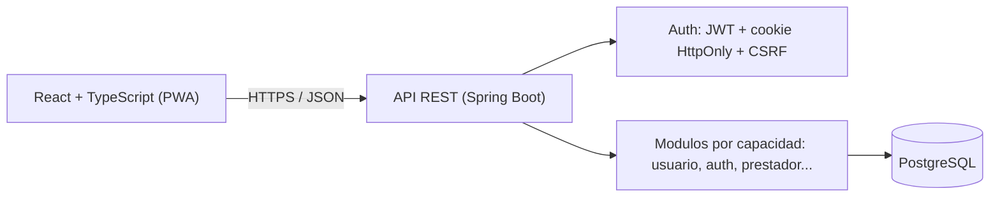

<div align="center">
  

# MOICA

**La confianza se construye entre todos.**

*Hackathon Nicaragua 2026 — Categoria Avanzado · Universidad Americana (UAM) · Equipo Nova Studios*

[](LICENSE)
[](backend/pom.xml)
[](backend/pom.xml)
[](frontend/package.json)
[](docker-compose.yml)

</div>

## Tabla de contenidos

- [Que es MOICA](#que-es-moica)
- [Caracteristicas](#caracteristicas)
- [Arquitectura](#arquitectura)
- [Instalacion rapida](#instalacion-rapida)
- [Datos y despliegue](#datos-y-despliegue)
- [Estructura del repositorio](#estructura-del-repositorio)
- [Documentacion](#documentacion)
- [Estado actual](#estado-actual)
- [Licencia](#licencia)

## Que es MOICA

MOICA conecta a personas que necesitan contratar un servicio (mantenimiento, reparacion, cuidado) con prestadores independientes que hoy operan de forma informal. Cada prestador arma su perfil desde el primer momento, pero solo aparece publicamente tras una verificacion documental manual en dos niveles (Basico y Profesional). Sin membresia ni pago por contacto: la comision se cobra solo cuando el prestador ya cobro.

## Caracteristicas

* **Verificacion en dos niveles** — identidad revisada por una persona antes de aparecer en la busqueda publica
* **Portafolio propio** — el prestador elige que trabajos muestra, con sus imagenes y en el orden que decida
* **Servicios y descubrimiento** — el prestador publica oficios; un visitante explora sin registrarse
* **Solicitudes con historial** — el cliente pide, el prestador acepta o rechaza, y cada cambio queda registrado
* **Chat y contactos tras aceptar** — mensajes de texto entre los dos participantes y revelacion controlada de los contactos externos
* **Calificaciones reales** — reputacion bidireccional y visible para todos
* **Cero cobros iniciales** — sin membresia ni pago por contacto
* **Sesiones seguras** — JWT + cookie `HttpOnly`, revocacion inmediata y proteccion CSRF
* **Segundo factor TOTP** — opcional para cualquier cuenta y obligatorio para el area administrativa
* **PWA mobile-first** — instalable, funciona como una app nativa

## Arquitectura



Monolito modular: **Java 21 + Spring Boot 4** · **React 19 + TypeScript** (PWA mobile-first) · **PostgreSQL 15** · **Docker**.

## Instalacion rapida

Requisitos: Docker, JDK 21+, Node.js 22 LTS+, Git.

```bash
git clone https://github.com/robertofabiot/moica-hackathon
cd moica-hackathon
cp .env.example .env
docker compose up -d                   # PostgreSQL + pgAdmin
cd backend && ./mvnw spring-boot:run   # API en :8080
```

```bash
cd frontend
npm ci
npm run dev                            # App en :5173
npm run build                          # build de produccion + PWA instalable
```

Pruebas: `./mvnw verify` (backend, necesita Docker) y `npm run test` (frontend).

Moica usa **dos** buckets de Cloudflare R2, con credenciales distintas: uno
publico para las imagenes de perfil y portafolio (`MOICA_R2_*`) y otro privado
para los documentos de verificacion (`MOICA_R2_PRIVADO_*`). Sin esas variables
la aplicacion arranca igual, pero las operaciones con archivos responden
`ALMACENAMIENTO_NO_DISPONIBLE`. Como aprovisionar cada bucket y su token:
[`Docs/Dev/Almacenamiento.md`](Docs/Dev/Almacenamiento.md).

## Datos y despliegue

En desarrollo, PostgreSQL corre en local mediante Docker Compose; no hay base
de datos remota. Cloudflare R2 es almacenamiento remoto de objetos para las
imagenes publicas y los expedientes de verificacion, y no sustituye a
PostgreSQL: la base conserva los datos y, de cada archivo, solo su URL publica
o su clave opaca.

P11-A incorpora Dockerfiles de backend y frontend para la demostracion publica
en Railway Free/Trial: Nginx sirve React/PWA y reenvia `/api` al backend privado;
PostgreSQL conserva los datos en un servicio privado con volumen. El dominio
HTTPS sera el proporcionado por Railway. El estado real y el procedimiento
estan en [DespliegueProduccion.md](Docs/Dev/DespliegueProduccion.md).

Desde la raiz, `node scripts/smoke-produccion.mjs` construye ambas imagenes y
comprueba una base nueva, Flyway, SPA/PWA, API, cookies/CSRF y persistencia tras
reinicio. Requiere Docker y Node 22; no usa el `.env` ni la base de desarrollo.

Produccion requiere `SPRING_PROFILES_ACTIVE=prod`, `MOICA_COOKIE_SEGURA=true`,
soporte real, variables PostgreSQL, JWT/TOTP secretos y ambos grupos R2 para
habilitar archivos. Nginx recibe `MOICA_BACKEND_UPSTREAM` y opcionalmente `PORT`,
`MOICA_PUBLIC_SCHEME` y `MOICA_PUBLIC_PORT`. La guia y `.env.example` clasifican
las variables; ningun secreto se incorpora al build de React.

## Estructura del repositorio

```text
moica-hackathon/
├── Docs/                   Documentacion tecnica, de producto y de marca
├── backend/                API REST (Spring Boot)
│   └── src/main/java/com/moica/   Codigo por capacidades
├── frontend/               PWA (React + TypeScript)
│   └── src/                Codigo por capacidades, paginas y estilos
├── .env.example            Plantilla de variables de entorno
└── docker-compose.yml      PostgreSQL y pgAdmin para desarrollo
```

## Documentacion

* [`Docs/Dev/PlanImplementacionMvp.md`](Docs/Dev/PlanImplementacionMvp.md) — alcance, secuencia P0-P11, dependencias y criterios de aceptacion
* [`Docs/Core/GIT_WORKFLOW.md`](Docs/Core/GIT_WORKFLOW.md) — flujo de Git y Pull Requests
* [`Docs/Dev/GuiaEntornoLocal.md`](Docs/Dev/GuiaEntornoLocal.md) — configuracion detallada del entorno
* [`Docs/Dev/ContratoDeApi.md`](Docs/Dev/ContratoDeApi.md) — endpoints, autenticacion y forma de los errores
* [`Docs/Dev/Almacenamiento.md`](Docs/Dev/Almacenamiento.md) — Cloudflare R2, buckets, permisos y comprobacion
* [`Docs/Dev/ESTANDARES_CODIGO.md`](Docs/Dev/ESTANDARES_CODIGO.md) — estandares de codigo y controles automaticos
* [`Docs/Design/`](Docs/Design/) y [`Docs/Marketing/`](Docs/Marketing/) — identidad de marca, mockups y modelo de negocio

## Estado actual

El MVP cuenta con un flujo funcional completo de punta a punta, enfocado en la formalización, confianza y seguridad del servicio:

* **Autenticación y Seguridad:** Registro, login con JWT en cookie `HttpOnly`, expiración y revocación inmediata de sesiones, y **2FA (TOTP)** obligatorio para el área `/admin`.
* **Perfil y Portafolio:** Perfil profesional con catálogo territorial de Managua, medios de contacto y galería de trabajos alojada en **Cloudflare R2**.
* **Verificación Documental:** Carga de expedientes privados y panel administrativo para revisión y asignación de niveles (*Básico* y *Profesional*).
* **Descubrimiento y Búsqueda:** Catálogo público accesible sin registro con filtros por texto, categoría y municipio (visibilidad exclusiva para prestadores verificados).
* **Gestión de Solicitudes:** Ciclo de contratación de extremo a extremo (solicitar, aceptar, rechazar, cancelar y completar) con trazabilidad histórica.
* **Chat y Contacto Seguro:** Hilo de mensajería interna habilitado tras la aceptación del servicio y revelación controlada de contactos externos.
* **Reputación Bidireccional:** Calificación mutua (1 a 5 estrellas + reseña) al completar el trabajo, con reputación pública para prestadores.
* **Moderación y Auditoría:** Apertura de reportes entre participantes y bandeja administrativa para asignar responsables, revisar el caso con su solicitud, mensajes y evidencias, y registrar la resolución; cada cambio queda versionado en un historial auditable (SCD2).
* **Medidas y Apelaciones:** Catálogo administrable de sanciones que **siempre elige una persona** —Moica no recomienda ni escala nada—, con una sola medida vigente por cuenta, sustitución que exige confirmación explícita, revocación de las sesiones afectadas y vencimiento automático del plazo que un administrador ya había fijado. La apelación se recibe por un canal externo de soporte y se registra desde el área administrativa, que puede aceptarla, rechazarla y reabrir el mismo expediente.

> **Alcance del MVP:** Se priorizó la verificación humana y la contratación segura. Pagos en línea integrados y mapas interactivos forman parte del roadmap posterior ([Docs/Core/post-mvp.md](Docs/Core/post-mvp.md)).

## Licencia

Moica no es codigo abierto. El codigo se publica para que pueda verse e
inspeccionarse, no para modificarlo, distribuirlo ni usarlo con fines
comerciales. El texto completo esta en [`LICENSE`](LICENSE). Las
dependencias de terceros conservan sus propias licencias.
