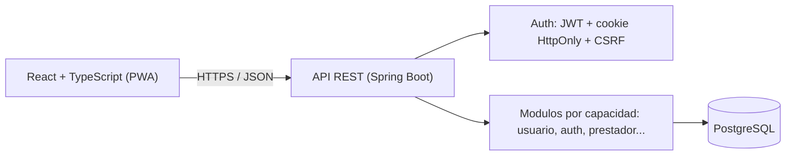

<div align="center">
  

# MOICA

**La confianza se construye entre todos.**

*Hackathon Nicaragua 2026 — Categoria Avanzado · Universidad Americana (UAM) · Equipo Nova Studios*

[](LICENSE)
[](backend/pom.xml)
[](backend/pom.xml)
[](frontend/package.json)
[](docker-compose.yml)

</div>

## Tabla de contenidos

- [Que es MOICA](#que-es-moica)
- [Caracteristicas](#caracteristicas)
- [Arquitectura](#arquitectura)
- [Instalacion rapida](#instalacion-rapida)
- [Datos y despliegue](#datos-y-despliegue)
- [Estructura del repositorio](#estructura-del-repositorio)
- [Documentacion](#documentacion)
- [Estado actual](#estado-actual)
- [Licencia](#licencia)

## Que es MOICA

MOICA conecta a personas que necesitan contratar un servicio (mantenimiento, reparacion, cuidado) con prestadores independientes que hoy operan de forma informal. Cada prestador arma su perfil desde el primer momento, pero solo aparece publicamente tras una verificacion documental manual en dos niveles (Basico y Profesional). Sin membresia ni pago por contacto: la comision se cobra solo cuando el prestador ya cobro.

## Caracteristicas

* **Verificacion en dos niveles** — identidad revisada por una persona antes de aparecer en la busqueda publica
* **Portafolio propio** — el prestador elige que trabajos muestra, con sus imagenes y en el orden que decida
* **Servicios y descubrimiento** — el prestador publica oficios; un visitante explora sin registrarse
* **Solicitudes con historial** — el cliente pide, el prestador acepta o rechaza, y cada cambio queda registrado
* **Chat y contactos tras aceptar** — mensajes de texto entre los dos participantes y revelacion controlada de los contactos externos
* **Calificaciones reales** — reputacion bidireccional y visible para todos
* **Cero cobros iniciales** — sin membresia ni pago por contacto
* **Sesiones seguras** — JWT + cookie `HttpOnly`, revocacion inmediata y proteccion CSRF
* **Segundo factor TOTP** — opcional para cualquier cuenta y obligatorio para el area administrativa
* **PWA mobile-first** — instalable, funciona como una app nativa

## Arquitectura



Monolito modular: **Java 21 + Spring Boot 4** · **React 19 + TypeScript** (PWA mobile-first) · **PostgreSQL 15** · **Docker**.

## Instalacion rapida

Requisitos: Docker, JDK 21+, Node.js 22 LTS+, Git.

```bash
git clone https://github.com/robertofabiot/moica-hackathon
cd moica-hackathon
cp .env.example .env
docker compose up -d                   # PostgreSQL + pgAdmin
cd backend && ./mvnw spring-boot:run   # API en :8080
```

```bash
cd frontend
npm ci
npm run dev                            # App en :5173
npm run build                          # build de produccion + PWA instalable
```

Pruebas: `./mvnw verify` (backend, necesita Docker) y `npm run test` (frontend).

Moica usa **dos** buckets de Cloudflare R2, con credenciales distintas: uno
publico para las imagenes de perfil y portafolio (`MOICA_R2_*`) y otro privado
para los documentos de verificacion (`MOICA_R2_PRIVADO_*`). Sin esas variables
la aplicacion arranca igual, pero las operaciones con archivos responden
`ALMACENAMIENTO_NO_DISPONIBLE`. Como aprovisionar cada bucket y su token:
[`Docs/Dev/Almacenamiento.md`](Docs/Dev/Almacenamiento.md).

## Datos y despliegue

En desarrollo, PostgreSQL corre en local mediante Docker Compose; no hay base
de datos remota. Cloudflare R2 es almacenamiento remoto de objetos para las
imagenes publicas y los expedientes de verificacion, y no sustituye a
PostgreSQL: la base conserva los datos y, de cada archivo, solo su URL publica
o su clave opaca.

La arquitectura productiva prevista usa Docker, configuracion por variables de
entorno y frontend y API bajo un mismo origen. El proveedor, la base remota,
los Dockerfiles y el procedimiento de despliegue corresponden al incremento
P11 y todavia no estan implementados.

## Estructura del repositorio

```text
moica-hackathon/
├── Docs/                   Documentacion tecnica, de producto y de marca
├── backend/                API REST (Spring Boot)
│   └── src/main/java/com/moica/   Codigo por capacidades
├── frontend/               PWA (React + TypeScript)
│   └── src/                Codigo por capacidades, paginas y estilos
├── .env.example            Plantilla de variables de entorno
└── docker-compose.yml      PostgreSQL y pgAdmin para desarrollo
```

## Documentacion

* [`Docs/Dev/PlanImplementacionMvp.md`](Docs/Dev/PlanImplementacionMvp.md) — alcance, secuencia P0-P11, dependencias y criterios de aceptacion
* [`Docs/Core/GIT_WORKFLOW.md`](Docs/Core/GIT_WORKFLOW.md) — flujo de Git y Pull Requests
* [`Docs/Dev/GuiaEntornoLocal.md`](Docs/Dev/GuiaEntornoLocal.md) — configuracion detallada del entorno
* [`Docs/Dev/ContratoDeApi.md`](Docs/Dev/ContratoDeApi.md) — endpoints, autenticacion y forma de los errores
* [`Docs/Dev/Almacenamiento.md`](Docs/Dev/Almacenamiento.md) — Cloudflare R2, buckets, permisos y comprobacion
* [`Docs/Dev/ESTANDARES_CODIGO.md`](Docs/Dev/ESTANDARES_CODIGO.md) — estandares de codigo y controles automaticos
* [`Docs/Design/`](Docs/Design/) y [`Docs/Marketing/`](Docs/Marketing/) — identidad de marca, mockups y modelo de negocio

## Estado actual

Ciclo de acceso completo: registro, inicio de sesion, sesion persistida con expiracion y revocacion, y cierre de sesion, con sus pantallas correspondientes.

Seguridad de la cuenta: cambio de contraseña que revoca todas las sesiones, segundo factor TOTP con su ciclo completo, sesion provisional hasta verificar el codigo y area `/admin` protegida por rol y segundo factor verificado.

Perfil de prestador: catalogo territorial de Managua, perfil propio con tipo, municipio principal, presentacion y cobertura, disponibilidad, medios de contacto y portafolio de trabajos con imagenes. Las imagenes publicas se guardan en Cloudflare R2 (ver [`Docs/Dev/Almacenamiento.md`](Docs/Dev/Almacenamiento.md)); PostgreSQL solo conserva su URL. Todo perfil nace `SIN_VERIFICAR` y permanece privado hasta que una persona administradora apruebe al menos la verificacion basica.

Verificacion documental: el prestador presenta su expediente —JPEG, PNG o PDF, hasta 5 MB por archivo— en una sola operacion, y una persona administradora con segundo factor verificado lo toma, lo aprueba, lo rechaza con motivo o revoca una verificacion ya concedida. Los documentos viven en un bucket privado de R2; PostgreSQL guarda solo una clave opaca y sus metadatos, y el archivo se abre con un enlace temporal que caduca. El nivel del perfil —`SIN_VERIFICAR`, `VERIFICADO_BASICO` o `PROFESIONAL_VERIFICADO`— lo proyecta ese flujo y nadie mas.

Servicios y descubrimiento: el prestador administra publicaciones e imagenes; un visitante explora sin autenticarse. Solo aparecen servicios `ACTIVO` de cuentas operativas, prestadores `DISPONIBLE` y perfiles con al menos verificacion basica. Un prestador `NO_DISPONIBLE` con verificacion basica conserva perfil y portafolio publicos, pero sin servicios listados y sin contratacion. La busqueda combina texto, categoria o subcategoria y municipio. Un precio nulo se muestra como «A convenir».

Solicitudes: un cliente autenticado con cuenta `ACTIVA` pide un servicio ajeno; el prestador con cuenta `ACTIVA` acepta o rechaza; cualquiera de los dos puede cancelar segun el estado; el prestador con cuenta `ACTIVA` marca como completada. Una cuenta restringida conserva la lectura y la cancelacion. Cada transicion queda en el historial.

Chat y contactos: aceptar una solicitud abre un hilo de mensajes de texto entre sus dos participantes y revela al cliente los medios de contacto externos del prestador. El hilo es la solicitud, sin entidad contenedora: se lee mientras la solicitud haya llegado a estar aceptada y solo admite mensajes nuevos mientras siga `ACEPTADA`; al cancelar o completar, el historial queda en solo lectura y los contactos ya revelados no vuelven a ocultarse. Una cancelacion desde `PENDIENTE` nunca abre hilo. Una cuenta restringida lee, pero no escribe. Un tercero recibe 404 y no puede confirmar que el hilo exista; el prestador tampoco recibe la revelacion de contactos, que pertenece al cliente. La interfaz se actualiza por short polling, sin WebSockets. El chat es solo de texto: sin imagenes, audios, archivos, edicion, reacciones ni cifrado de extremo a extremo.

Calificaciones y reputacion: cuando el prestador marca la solicitud como completada, cada participante puede calificar una sola vez a la contraparte con una puntuacion de una a cinco estrellas y un comentario opcional. El calificado y el rol —`CLIENTE` o `PRESTADOR`— los deriva el servidor de la solicitud, nunca el navegador: el cliente califica al prestador y el prestador al cliente, y nadie puede calificarse a si mismo. Calificar es opcional y no hacerlo no penaliza. Las calificaciones son inmutables: no se editan ni se borran. La reputacion se calcula desde esas filas y se mantiene separada por rol, sin tabla `reputacion`: la del prestador es publica y viaja en el listado, en el detalle y en el perfil; la del cliente solo la ve el prestador participante desde su propia solicitud. Quien todavia no tiene calificaciones aparece como «Sin calificaciones», nunca como `0.0`.

Reportes y casos de moderacion: desde una solicitud que llego a estar aceptada, cualquiera de los dos participantes puede reportar a la contraparte. Da igual donde terminara la solicitud —completada o cancelada despues de aceptarse siguen admitiendolo—; una que nunca se acepto, no. El reporte abre un caso de moderacion con su primera version historica SCD2 en la misma transaccion, y cada participante abre como maximo uno por solicitud, asi que una solicitud admite hasta dos: uno por lado. El reportado lo deriva el servidor de la solicitud, nunca el navegador. Reportar no cambia el estado de la solicitud, no toca ninguna cuenta, no asigna administrador, no elige medida y no sanciona automaticamente a nadie: en el MVP cada medida la decide una persona. Una cuenta restringida conserva el reporte, porque es la via por la que alguien pide ayuda. Cada quien consulta solo el caso que el mismo presento; la revision administrativa, las resoluciones y el catalogo de medidas llegan despues. Todavia no hay pagos ni mapas.

## Licencia

Moica no es codigo abierto. El codigo se publica para que pueda verse e
inspeccionarse, no para modificarlo, distribuirlo ni usarlo con fines
comerciales. El texto completo esta en [`LICENSE`](LICENSE). Las
dependencias de terceros conservan sus propias licencias.
