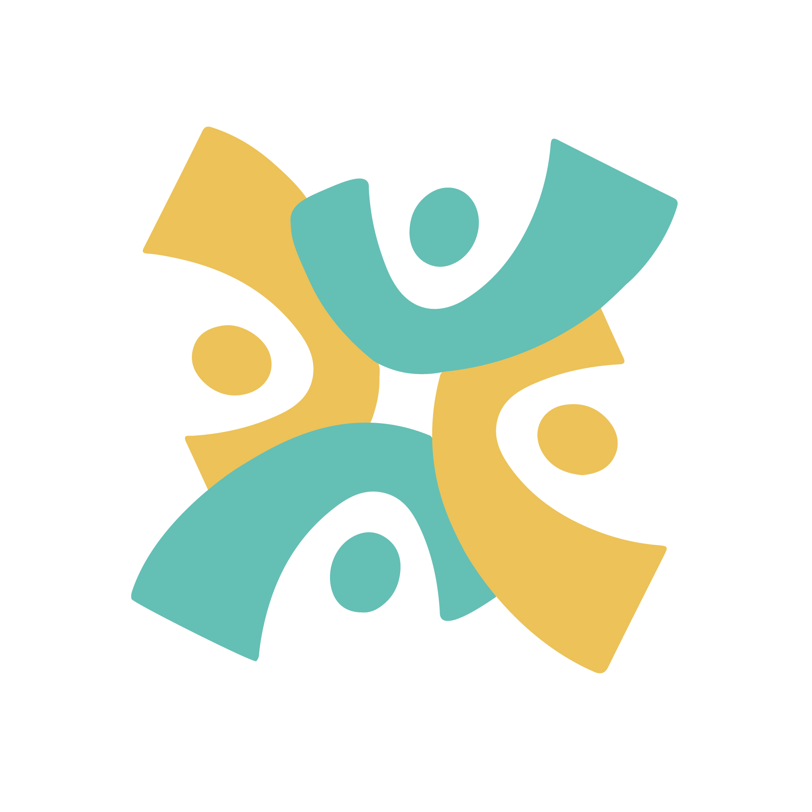
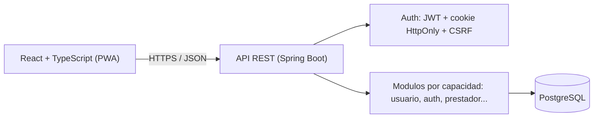

<div align="center">
  

# MOICA

**La confianza se construye entre todos.**

*Hackathon Nicaragua 2026 — Categoria Avanzado · Universidad Americana (UAM) · Equipo Nova Studios*

[](LICENSE)
[](backend/pom.xml)
[](backend/pom.xml)
[](frontend/package.json)
[](docker-compose.yml)

</div>

## Tabla de contenidos

- [Que es MOICA](#que-es-moica)
- [Caracteristicas](#caracteristicas)
- [Arquitectura](#arquitectura)
- [Instalacion rapida](#instalacion-rapida)
- [Estructura del repositorio](#estructura-del-repositorio)
- [Documentacion](#documentacion)
- [Estado actual](#estado-actual)
- [Licencia](#licencia)

## Que es MOICA

MOICA conecta a personas que necesitan contratar un servicio (mantenimiento, reparacion, cuidado) con prestadores independientes que hoy operan de forma informal. Cada prestador arma su perfil desde el primer momento, pero solo aparece publicamente tras una verificacion documental manual en dos niveles (Basico y Profesional). Sin membresia ni pago por contacto: la comision se cobra solo cuando el prestador ya cobro.

## Caracteristicas

* **Verificacion en dos niveles** — identidad revisada por una persona antes de aparecer en la busqueda publica
* **Portafolio dinamico** — el historial de trabajos se arma solo, con cada servicio completado
* **Calificaciones reales** — reputacion bidireccional y visible para todos
* **Cero cobros iniciales** — sin membresia ni pago por contacto
* **Sesiones seguras** — JWT + cookie `HttpOnly`, revocacion inmediata y proteccion CSRF
* **Segundo factor TOTP** — opcional para cualquier cuenta y obligatorio para el area administrativa
* **PWA mobile-first** — instalable, funciona como una app nativa

## Arquitectura



Monolito modular: **Java 21 + Spring Boot 4** · **React 19 + TypeScript** (PWA mobile-first) · **PostgreSQL 15** · **Docker**.

## Instalacion rapida

Requisitos: Docker, JDK 21+, Node.js 22 LTS+, Git.

```bash
git clone https://github.com/robertofabiot/moica-hackathon
cd moica-hackathon
cp .env.example .env
docker compose up -d                   # PostgreSQL + pgAdmin
cd backend && ./mvnw spring-boot:run   # API en :8080
```

```bash
cd frontend
npm ci
npm run dev                            # App en :5173
npm run build                          # build de produccion + PWA instalable
```

Pruebas: `./mvnw verify` (backend, necesita Docker) y `npm run test` (frontend).

## Estructura del repositorio

```text
moica-hackathon/
├── Docs/                   Documentacion tecnica, de producto y de marca
├── backend/                API REST (Spring Boot)
│   └── src/main/java/com/moica/   Codigo por capacidades
├── frontend/               PWA (React + TypeScript)
│   └── src/                Codigo por capacidades, paginas y estilos
├── .env.example            Plantilla de variables de entorno
└── docker-compose.yml      PostgreSQL y pgAdmin para desarrollo
```

## Documentacion

* [`Docs/Core/GIT_WORKFLOW.md`](Docs/Core/GIT_WORKFLOW.md) — flujo de Git y Pull Requests
* [`Docs/Dev/GuiaEntornoLocal.md`](Docs/Dev/GuiaEntornoLocal.md) — configuracion detallada del entorno
* [`Docs/Dev/ContratoDeApi.md`](Docs/Dev/ContratoDeApi.md) — endpoints, autenticacion y forma de los errores
* [`Docs/Dev/ESTANDARES_CODIGO.md`](Docs/Dev/ESTANDARES_CODIGO.md) — estandares de codigo y controles automaticos
* [`Docs/Design/`](Docs/Design/) y [`Docs/Marketing/`](Docs/Marketing/) — identidad de marca, mockups y modelo de negocio

## Estado actual

Ciclo de acceso completo: registro, inicio de sesion, sesion persistida con expiracion y revocacion, y cierre de sesion, con sus pantallas correspondientes.

Seguridad de la cuenta: cambio de contraseña que revoca todas las sesiones, segundo factor TOTP con su ciclo completo, sesion provisional hasta verificar el codigo y area `/admin` protegida por rol y segundo factor verificado.

Todavia no hay perfiles de prestador, verificacion documental, servicios, solicitudes, chat ni calificaciones: cada uno llega con su propio incremento del plan.

## Licencia

Este proyecto se distribuye bajo los terminos de la Licencia MIT. Para mas informacion, consulte el archivo [`LICENSE`](LICENSE).
