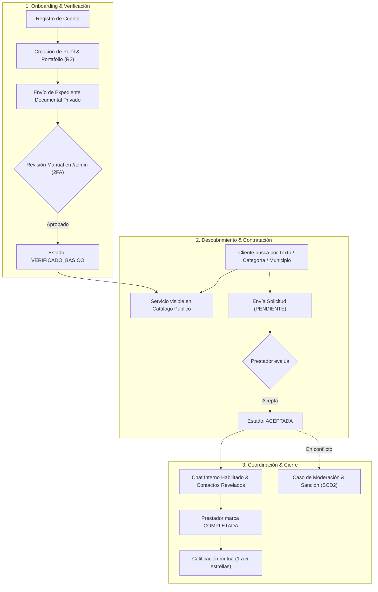
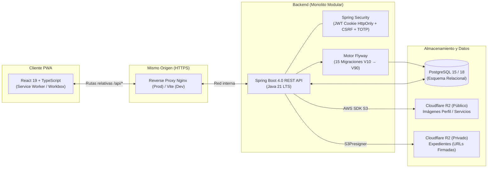

<div align="center">
  

# MOICA

**La confianza se construye entre todos.**

*Hackathon Nicaragua 2026 — Categoría Avanzado · Reto Conecta Emprende · Universidad Americana (UAM) · Equipo Nova Studios*

[](LICENSE)
[](backend/pom.xml)
[](backend/pom.xml)
[](frontend/package.json)
[](frontend/package.json)
[](docker-compose.yml)
[-F38020?logo=cloudflare&logoColor=white)](Docs/Dev/Almacenamiento.md)
[](docker-compose.yml)
[](frontend/vite.config.ts)
[](https://frontend-production-90df.up.railway.app)
[](backend/pom.xml)

</div>

---

## Tabla de contenidos

1. [Descripción](#descripción)
2. [Arquitectura](#arquitectura)
3. [Dependencias principales](#dependencias-principales)
4. [Estructura modular](#estructura-modular)
5. [Variables de entorno](#variables-de-entorno)
6. [Ejecución local](#ejecución-local)
7. [Scripts del proyecto](#scripts-del-proyecto)
8. [API](#api)
9. [Seguridad](#seguridad)
10. [Producción](#producción)
11. [Documentación complementaria](#documentación-complementaria)
12. [Licencia](#licencia)

---

## Descripción

### Qué es MOICA
**MOICA** es una Progressive Web App (PWA) *mobile-first* que conecta a clientes con trabajadores independientes, oficios técnicos (reparación, mantenimiento, cuidado) y microemprendimientos en el departamento de Managua. Opera bajo el principio de **acceso inmediato y validación posterior**: cualquier prestador puede registrarse, armar su perfil y preparar sus publicaciones desde el primer instante, pero solo adquiere visibilidad en el catálogo público tras superar una verificación documental manual.

### Problema que resuelve
* **Informalidad y dispersión:** La oferta local se canaliza por redes sociales desestructuradas y recomendaciones de boca a boca, sin respaldo de identidad ni garantías de servicio.
* **Inseguridad y asimetría:** Quien contrata desconoce los antecedentes del prestador; a su vez, el trabajador carece de canales formales de trazabilidad ante acuerdos verbales.
* **Modelos extractivos:** Las plataformas tradicionales castigan la economía informal con membresías forzosas o cobro anticipado por «contactos» (*leads*) que no aseguran ingresos. MOICA elimina estas barreras: no cobra por adelantado ni por contacto, exige verificación humana de identidad y construye reputación verificable.

### Alcance real del MVP
* **Implementado de punta a punta:** Registro e inicio de sesión con JWT en cookie `HttpOnly`; **segundo factor TOTP (RFC 6238)** obligatorio para administradores y opcional para usuarios; perfiles profesionales con catálogo territorial de Managua y portafolio en **Cloudflare R2**; verificación documental en dos niveles (`VERIFICADO_BASICO` y `PROFESIONAL_VERIFICADO`) revisada manualmente en `/admin`; catálogo público con búsqueda multifiltro; gestión de solicitudes con máquina de estados e historial inmutable; chat de texto persistente habilitado tras aceptación; revelación controlada de contactos externos; calificaciones mutuas (1-5 estrellas) al completar; y panel de moderación con medidas disciplinarias y versionado histórico inmutable (SCD2).
* **Límites conscientes (Post-MVP):** Pagos directos integrados (la comisión se percibe post-cobro en el modelo de negocio posterior), geolocalización satelital/mapas en vivo, multimedia/audios en chat y biometría automática forman parte del roadmap futuro ([`Docs/Core/post-mvp.md`](Docs/Core/post-mvp.md)).

### Principales actores

| Actor | Rol en el sistema | Capacidades principales |
|---|---|---|
| **Visitante** | Anónimo / Explorador | Explora el catálogo público, filtra por municipio/categoría y consulta portafolios verificados sin registrarse. |
| **Cliente** | Contratante (toda cuenta) | Solicita servicios, cancela según reglas de estado, chatea tras la aceptación, accede a contactos revelados, califica y reporta. |
| **Prestador** | Oferente de servicios | Configura perfil, gestiona portafolio y disponibilidad, somete expediente a revisión, acepta/rechaza solicitudes, coordina por chat y completa servicios. |
| **Administrador** | Operador de control interno | Requiere rol y 2FA TOTP verificado; audita expedientes en R2 con URLs temporales, gestiona casos de moderación y aplica medidas disciplinarias. |

### Recorrido funcional resumido



---

## Arquitectura

### Visión general

```text
React + TypeScript PWA
        ↓
Spring Boot REST API
        ↓
PostgreSQL
```



### Principios y decisiones de diseño
* **Monolito modular:** Cero microservicios. Un único artefacto con alta cohesión y bajo acoplamiento delimitado por paquetes de dominio (`auth`, `usuario`, `prestador`, `servicio`, `solicitud`, `chat`, `verificacion`, `moderacion`). Elimina latencias de red distribuida, garantiza consistencia transaccional ACID en PostgreSQL y simplifica el despliegue.
* **Monorepo unificado:** Frontend (`frontend/`), backend (`backend/`) y especificaciones (`Docs/`) conviven en el mismo árbol, sincronizando contratos y tipos de forma atómica.
* **Mismo origen en producción (*Same-Origin*):** Nginx sirve la PWA y enruta `/api/*` hacia el backend en el mismo host. Erradica CORS en producción y habilita cookies de sesión `HttpOnly`, `SameSite=Lax` y `Secure`.
* **Cloudflare R2 para almacenamiento de objetos:** Sin binarios en PostgreSQL. Dos buckets estrictamente segregados mediante compatibilidad S3: **Público** (imágenes con entrega directa) y **Privado** (expedientes de identidad sin acceso anónimo, servidos exclusivamente mediante URLs temporales prefirmadas de 5 minutos generadas con `S3Presigner`).
* **Flyway para migraciones versionadas:** 15 scripts SQL versionados (`V10` a `V90`) ejecutados al arranque con validación estricta de Hibernate (`ddl-auto=validate`).
* **Docker para construcción y empaquetado:** *Multi-stage builds* reproducibles sobre imágenes base ligeras (Eclipse Temurin JRE 21 y Nginx Alpine).

---

## Dependencias principales

| Área | Tecnologías clave | Propósito técnico |
|---|---|---|
| **Backend** | Java 21 LTS · Spring Boot 4.0.7 | Núcleo de la API REST, inyección de dependencias y servidor embebido Tomcat. |
| | Jakarta Validation · Spring Data JPA · Flyway 10+ | Validación declarativa de DTOs, persistencia relacional ORM y migraciones versionadas. |
| | Spring Security · JJWT 0.13.0 · BCrypt | Cadena de filtros de seguridad, tokens HMAC-SHA256 y hashing de contraseñas. |
| | java-otp 0.4.0 · commons-codec | Implementación nativa de RFC 6238 (TOTP) sobre `javax.crypto` y codificación Base32. |
| | AWS SDK for Java v2 2.46.7 (`s3`, `apache5-client`) | Integración con Cloudflare R2 y generación de URLs firmadas (`S3Presigner`). |
| **Frontend** | React 19.2 · TypeScript 5.8 · Vite 8.2 | SPA reactiva con tipado estático riguroso y empaquetado de alto rendimiento. |
| | vite-plugin-pwa 1.3 (Workbox) | Soporte de Progressive Web App instalable y precarga de activos estáticos. |
| | React Router 8.3 · TanStack Query 5.101 | Enrutamiento del cliente y sincronización asíncrona de estado del servidor. |
| | React Hook Form 7.85 · Zod 4.4 · qrcode.react | Manejo accesible de formularios, validación de esquemas y generación de QR para 2FA. |
| **Pruebas** | Testcontainers 1.21 · PostgreSQL Container · MockMvc | Pruebas de integración reales (`*IT`) del backend contra PostgreSQL en Docker. |
| | Vitest 4.1 · Testing Library 16.3 · JSDOM 30 | Pruebas unitarias y de componentes frontend orientadas a accesibilidad. |
| **Calidad** | SpotBugs 4.10 · Spotless 3.9 · ESLint 10 · Prettier | Análisis estático de defectos, Google Java Format y estandarización de estilo. |
| **Infra** | Docker · Docker Compose · Nginx 1.27 Alpine | Contenedores de desarrollo y producción; reverse proxy de mismo origen. |

---

## Estructura modular

### Árbol del repositorio

```text
moica-hackathon/
├── Docs/                          # Documentación técnica, producto, diseño y negocio
│   ├── Core/                      # Definición de producto, reglas de negocio y GitFlow
│   ├── Design/                    # Identidad de marca, logos vectoriales y UX
│   ├── Dev/                       # Contrato de API, R2, entorno local, matriz y despliegue
│   └── Marketing/                 # Buyer personas, propuesta de valor y Canvas
├── backend/                       # API REST con Spring Boot 4 y Java 21
│   ├── Dockerfile                 # Multi-stage build para imagen de producción JRE
│   ├── pom.xml                    # Configuración de dependencias Maven y plugins de calidad
│   └── src/
│       ├── main/java/com/moica/   # Monolito modular agrupado por capacidades de dominio
│       │   ├── admin/             # Métricas, panel administrativo y bootstrapping
│       │   ├── auth/              # JWT, cookies HttpOnly, sesiones y segundo factor TOTP
│       │   ├── calificacion/      # Evaluaciones bidireccionales y cálculo de reputación
│       │   ├── catalogo/          # Taxonomía de oficios y división territorial (Managua)
│       │   ├── chat/              # Mensajería interna e historial por solicitud
│       │   ├── comun/             # Filtros CSRF, seguridad y manejo uniforme de errores
│       │   ├── moderacion/        # Casos de disputa, medidas disciplinarias e historial SCD2
│       │   ├── portafolio/        # Galería de trabajos anteriores del prestador
│       │   ├── prestador/         # Perfil profesional, cobertura y disponibilidad
│       │   ├── servicio/          # Publicaciones de servicios y búsqueda pública
│       │   ├── solicitud/         # Máquina de estados de contratación e historial
│       │   ├── usuario/           # Cuentas, roles y estados disciplinarios
│       │   └── verificacion/      # Expedientes documentales y validación de insignias
│       └── main/resources/db/     # 15 migraciones Flyway versionadas (V10 a V90)
├── frontend/                      # Cliente PWA con React 19 y TypeScript
│   ├── Dockerfile                 # Multi-stage build con Nginx Alpine de producción
│   ├── package.json               # Dependencias npm y scripts de compilación
│   ├── vite.config.ts             # Configuración de Vite, proxy inverso y Service Worker
│   └── src/
│       ├── capacidades/           # Módulos cliente espejados con el backend
│       ├── comun/                 # Componentes UI compartidos, layout y diseño
│       └── paginas/               # Vistas principales de enrutamiento
├── scripts/                       # Automatización de capturas headless (BiDi) y verificación
├── docker-compose.yml             # Servicios locales (PostgreSQL 15 + pgAdmin 4)
├── .env.example                   # Plantilla de variables de entorno seguras
└── README.md                      # Este documento
```

---

## Variables de entorno

La configuración sigue el estándar de *12-Factor App*. Copie la plantilla base para desarrollo local: `cp .env.example .env`.

> [!CAUTION]
> El archivo `.env` está ignorado por Git. **Nunca incluya secretos productivos en el repositorio.** Los valores indicados son ejemplos seguros para desarrollo local.

| Variable | Propósito | Req. | Ejemplo seguro (Local) |
|---|---|:---:|---|
| `MOICA_DB_NOMBRE` | Nombre de la base de datos PostgreSQL | Sí | `moica_db` |
| `MOICA_DB_USUARIO` | Usuario de PostgreSQL | Sí | `moica_dev` |
| `MOICA_DB_CLAVE` | Contraseña de PostgreSQL | Sí | `clave_local_de_desarrollo` |
| `MOICA_DB_HOST` | Host de conexión para el backend | Sí | `localhost` |
| `MOICA_DB_PORT` | Puerto de PostgreSQL (cambiar a `5433` si `5432` está en uso) | Sí | `5432` |
| `MOICA_BACKEND_PORT` | Puerto HTTP del servidor Spring Boot | No | `8080` |
| `MOICA_JWT_SECRETO` | Clave criptográfica para firma HMAC-SHA256 (mínimo 32 bytes) | Sí | `secreto_local_de_desarrollo_cambialo_en_produccion` |
| `MOICA_SESION_DURACION`| Duración de la sesión en formato ISO-8601 | No | `P7D` |
| `MOICA_COOKIE_SEGURA` | Atributo `Secure` en cookies (`false` local, `true` prod HTTPS) | Sí | `false` |
| `MOICA_TOTP_CLAVE_CIFRADO`| Clave AES-GCM para cifrar secretos TOTP en reposo (Base64) | Sí | `Y2xhdmUtcHVibGljYS1kZS1kZXNhcnJvbGxvLW1vaWM=` |
| `MOICA_R2_ID_CUENTA` | Account ID de Cloudflare para bucket público | Cond.* | `id_cuenta_ejemplo` |
| `MOICA_R2_ACCESS_KEY_ID` | Access Key ID para bucket público | Cond.* | `access_key_publica` |
| `MOICA_R2_SECRET_ACCESS_KEY`| Secret Access Key para bucket público | Cond.* | `secret_key_publica` |
| `MOICA_R2_BUCKET_PUBLICO` | Nombre del bucket público de imágenes | Cond.* | `moica-publico-dev` |
| `MOICA_R2_URL_PUBLICA_BASE` | Dominio HTTPS público del bucket de imágenes | Cond.* | `https://pub-ejemplo.r2.dev` |
| `MOICA_R2_PRIVADO_ID_CUENTA`| Account ID de Cloudflare para bucket privado | Cond.* | `id_cuenta_ejemplo` |
| `MOICA_R2_PRIVADO_ACCESS_KEY_ID` | Access Key ID exclusivo del bucket privado | Cond.* | `access_key_privada` |
| `MOICA_R2_PRIVADO_SECRET_ACCESS_KEY`| Secret Access Key del bucket privado | Cond.* | `secret_key_privada` |
| `MOICA_R2_BUCKET_PRIVADO` | Nombre del bucket privado de expedientes | Cond.* | `moica-privado-dev` |
| `MOICA_DOCUMENTO_URL_TEMPORAL_DURACION` | Expiración de enlaces prefirmados (máx 1 hora) | No | `PT5M` |
| `MOICA_ADMIN_CORREO` | Correo de la cuenta a promover como administrador al arrancar | No | `admin@moica.ni` |
| `MOICA_EXPIRACION_MEDIDAS_PERIODO` | Chequeo de vencimiento de sanciones temporales | No | `PT1M` |
| `MOICA_SOPORTE_CANAL` | Contacto externo para recepción de apelaciones | No | `soporte@moica.ni` |

*\* Condicional: Si no se configuran las variables de R2, el sistema arranca con normalidad; solo las acciones multimedia responderán `503 ALMACENAMIENTO_NO_DISPONIBLE`.*

---

## Ejecución local

### Requisitos previos
* **Docker & Docker Compose** (v24+) · **Java JDK 21 LTS** · **Node.js 22 LTS** · **Git**.

### Paso a paso

```bash
# 1. Clonar e inicializar entorno
git clone https://github.com/robertofabiot/moica-hackathon.git && cd moica-hackathon
cp .env.example .env

# 2. Levantar base de datos PostgreSQL
docker compose up -d

# 3. Iniciar Backend (Spring Boot API en :8080)
cd backend && ./mvnw spring-boot:run
# En Windows: .\mvnw.cmd spring-boot:run

# 4. En otra terminal, iniciar Frontend (PWA en :5173 con proxy a :8080)
cd frontend && npm ci && npm run dev
```

Verificación del estado del backend:
```bash
curl http://localhost:8080/actuator/health
# {"status":"UP"}
```

### Compilación y pruebas
* **Backend:** `./mvnw verify` (Ejecuta pruebas unitarias, integración con **Testcontainers**, SpotBugs y Spotless).
* **Frontend:** `npm run test` (Vitest), `npm run typecheck` (TypeScript) y `npm run lint` (ESLint).
* **Compilación a producción:**
  * Frontend: `cd frontend && npm run build` (Genera `dist/` con PWA Service Worker).
  * Backend: `cd backend && ./mvnw clean package -DskipTests` (Genera el `.jar` ejecutable).

---

## Scripts del proyecto

| Comando | Contexto | Acción que ejecuta |
|---|---|---|
| `npm run dev` | `frontend/` | Inicia servidor de desarrollo Vite en el puerto `5173` con HMR y proxy reverso. |
| `npm run build` | `frontend/` | Ejecuta comprobación `tsc -b` y compila los activos estáticos para producción. |
| `npm run test` | `frontend/` | Ejecuta la suite de pruebas unitarias y de integración de componentes con Vitest. |
| `npm run typecheck` | `frontend/` | Comprobación estricta de tipos de TypeScript sin emitir archivos. |
| `npm run lint` / `format`| `frontend/` | Análisis estático con ESLint y formateo automático de código con Prettier. |
| `./mvnw spring-boot:run`| `backend/` | Compila y levanta la API Spring Boot ejecutando migraciones Flyway pendientes. |
| `./mvnw verify` | `backend/` | Valida compilación, pruebas Surefire, integración Failsafe (Testcontainers), Spotless y SpotBugs. |
| `./mvnw spotless:apply` | `backend/` | Formatea el código fuente según Google Java Format. |
| `docker compose up -d` | Raíz | Inicializa los contenedores de PostgreSQL 15 y pgAdmin 4 en segundo plano. |
| `bash scripts/ejecutar_capturas.sh` | Raíz | Lanza Firefox headless (WebDriver BiDi) y ejecuta capturas de pantalla multi-viewport. |

---

## API

Documentación completa de endpoints, esquemas JSON y códigos de error:  
👉 [**Docs/Dev/ContratoDeApi.md**](Docs/Dev/ContratoDeApi.md)

### Ejemplos reales de interacción

#### 1. Iniciar sesión (`POST /api/auth/sesion`)
Genera la sesión registrada en PostgreSQL y entrega la cookie `moica_sesion` junto al token CSRF:

```bash
curl -i -X POST http://localhost:8080/api/auth/sesion \
  -H "Content-Type: application/json" \
  -c cookies.txt \
  -d '{"correoElectronico":"valeria@ejemplo.com","clave":"ContraseñaSegura123!"}'
```

```http
HTTP/1.1 201 Created
Set-Cookie: moica_sesion=eyJhbGciOiJIUzI1NiJ9...; Path=/; HttpOnly; SameSite=Lax
Set-Cookie: XSRF-TOKEN=4a7c8b12-9e3f-42a1...; Path=/; SameSite=Lax
Content-Type: application/json

{
  "usuario": {
    "id": 14,
    "nombreCompleto": "Valeria Martínez",
    "correoElectronico": "valeria@ejemplo.com",
    "rol": "USUARIO",
    "estadoCuenta": "ACTIVA"
  },
  "sesion": {
    "fechaInicio": "2026-09-05T14:30:00-06:00",
    "fechaExpiracion": "2026-09-12T14:30:00-06:00",
    "pendienteDeSegundoFactor": false
  }
}
```

#### 2. Búsqueda pública de servicios (`GET /api/servicios`)
```bash
curl -X GET "http://localhost:8080/api/servicios?texto=refrigeracion&idMunicipio=1"
```

```json
[
  {
    "id": 3,
    "nombre": "Mantenimiento preventivo de aire acondicionado",
    "precioReferencia": 850.00,
    "nombreSubcategoria": "Refrigeración y Climatización",
    "nombrePrestador": "Servicios García",
    "nivelVerificacion": "PROFESIONAL_VERIFICADO",
    "admiteContratacion": true,
    "reputacionPrestador": { "promedio": 4.85, "cantidadCalificaciones": 26 }
  }
]
```

#### 3. Crear solicitud de servicio (`POST /api/solicitudes`)
Operación mutable protegida por CSRF; requiere sesión activa:

```bash
TOKEN=$(grep XSRF-TOKEN cookies.txt | awk '{print $7}')

curl -X POST http://localhost:8080/api/solicitudes \
  -b cookies.txt \
  -H "Content-Type: application/json" \
  -H "X-XSRF-TOKEN: $TOKEN" \
  -d '{
    "idServicioPublicado": 3,
    "descripcionNecesidad": "Mantenimiento de 2 unidades inverter.",
    "idMunicipio": 1,
    "indicacionUbicacion": "Altamira, de la Vicky 2c al sur",
    "fechaPreferida": "2026-09-10"
  }'
```

```json
{
  "id": 42,
  "idServicioPublicado": 3,
  "idCliente": 14,
  "idPrestador": 7,
  "estadoActual": "PENDIENTE",
  "historial": [
    { "id": 89, "estadoNuevo": "PENDIENTE", "actor": "CLIENTE", "instante": "2026-09-05T15:10:22-06:00" }
  ]
}
```

---

## Seguridad

1. **Sesiones registradas:** Cada login crea una fila en la tabla `sesion` de PostgreSQL identificada por UUID (`jti`). El estado y vigencia de la sesión residen en el servidor.
2. **JWT en cookie `HttpOnly`:** El token firmado viaja exclusivamente en la cookie `moica_sesion` con flags `HttpOnly`, `SameSite=Lax` y `Secure` en producción. Cero almacenamiento en `localStorage` o `sessionStorage` (inmune a XSS).
3. **Expiración determinista:** Duración configurada por defecto a 7 días (`P7D`). No se aplican extensiones silenciosas infinitas.
4. **Revocación inmediata:** `DELETE /api/auth/sesion`, cambio de credenciales o sanción administrativa marca la sesión como revocada en base de datos al instante. Cualquier uso posterior responde `401 Unauthorized`.
5. **Segundo factor TOTP (RFC 6238):** Obligatorio para rol administrativo. El secreto Base32 se guarda cifrado en reposo con **AES-GCM**. Tras el login, una cuenta con 2FA queda en sesión provisional (`pendienteDeSegundoFactor: true`) hasta validar el código.
6. **Roles y autorización compuesta:** Rutas `/api/admin/**` exigen concurrentemente tener rol administrativo y sesión con TOTP verificado.
7. **Propiedad estricta de recursos:** Los recursos ajenos (solicitudes, chats, expedientes) responden deliberadamente `404 RECURSO_NO_ENCONTRADO` para prevenir la divulgación de existencia de registros a terceros.
8. **Estados de cuenta:** Cuentas `RESTRINGIDA_TEMPORAL` no pueden contratar ni aceptar trabajos; cuentas `SUSPENDIDA_*` sufren revocación inmediata de sesiones y respuesta `403 ACCESO_DENEGADO`.
9. **Protección CSRF activa:** Validación estricta de token `XSRF-TOKEN` / `X-XSRF-TOKEN` en todos los métodos HTTP mutables (`POST`, `PUT`, `DELETE`).
10. **Documentos privados en Cloudflare R2:** Bucket privado sin acceso web público. La entrega de expedientes a administradores se efectúa exclusivamente mediante URLs firmadas temporales con expiración máxima de 5 minutos y directivas `no-store`.

---

## Producción

* **Proveedor de despliegue:** **Railway** (Proyecto `victorious-embrace`, entorno `production`).
* **Arquitectura Docker:** Contenedor Nginx Alpine (sirviendo la PWA y actuando como *Reverse Proxy* de mismo origen) + Contenedor Spring Boot 4 (Java 21 JRE).
* **PostgreSQL remoto:** Instancia administrada PostgreSQL 18 en red privada interna sin puertos expuestos públicamente.
* **Cloudflare R2:** Buckets `moica-publico-dev` (imágenes públicas) y `moica-privado-dev` (expedientes protegidos con firma temporal).
* **URL pública de la aplicación:** 🌐 **[https://frontend-production-90df.up.railway.app](https://frontend-production-90df.up.railway.app)**
* **Guía técnica de despliegue:** 👉 [**Docs/Dev/DespliegueProduccion.md**](Docs/Dev/DespliegueProduccion.md)

---

## Documentación complementaria

* [`Docs/Core/DefinicionProducto.md`](Docs/Core/DefinicionProducto.md) — Definición funcional consolidada y reglas de negocio del MVP.
* [`Docs/Core/GIT_WORKFLOW.md`](Docs/Core/GIT_WORKFLOW.md) — Flujo de trabajo en Git (GitFlow simplificado) y Conventional Commits.
* [`Docs/Dev/ContratoDeApi.md`](Docs/Dev/ContratoDeApi.md) — Contrato de API exhaustivo, endpoints, payloads y errores.
* [`Docs/Dev/Almacenamiento.md`](Docs/Dev/Almacenamiento.md) — Especificación de Cloudflare R2 y compatibilidad S3.
* [`Docs/Dev/DespliegueProduccion.md`](Docs/Dev/DespliegueProduccion.md) — Evidencias de infraestructura y verificación en Railway.
* [`Docs/Dev/MatrizCumplimiento.md`](Docs/Dev/MatrizCumplimiento.md) — Trazabilidad de criterios de aceptación del Hackathon.

---

## Licencia

MOICA se publica bajo licencia **Source-Available** exclusivamente para inspección y evaluación del jurado del **Hackathon Nicaragua 2026**. No autoriza uso comercial ni distribución sin autorización expresa. Consulte [`LICENSE`](LICENSE).
